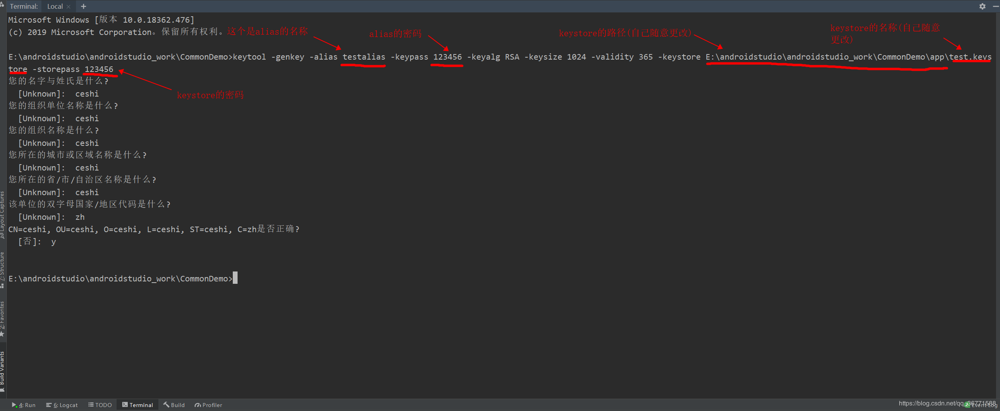

# AndroidStudio
AndroidStudio是安卓目前主流的开发工具，这里主要说明AndroidStudio在使用过程中一些有助于提高我们工作效率的使用技巧

## 快捷键
|   快捷键  |   含义    |   as路径  |
|   ----   |    ---    |    ---   |
| command + fn + f12 | 查看当前类所有方法 | `Navigate -> file structure` |
| command + shift  + A | 全局搜索 |
| alt + enter | 字符串快捷本地化 |
| ctrl + alt + f | 生成全局变量(快捷键跟搜狗输入法快捷键有冲突) |
| common + shift + u | 字母小写转换成大写,如果点击一次无效，u按2次 |
| control + alt + o | 删除类中没有用到的引用 |
| shift + f6 | 更改类名或者变量名 |
| common + p | 提示方法参数|
| F2 | 定位到错误代码 |
| alt(option) + F1 | 查找文件所在目录位置 | 左侧文件列表上有一个靶心的图标，点击效果一样 |
| ctrl(command) + -/+ | 折叠/展开代码 |
| ctrl(command) + d| 赋值代码 | 需要先选中代码 |
| ctrl(command) + shaift + 上/下键 | 上/下移动代码 |
| ctrl(command) + shaift + 左/右键 | 选中 左/右 代码 |
| alt + 鼠标上下移动 | 同时编辑多行代码 |
| control + h | 查看继承关系 |
| alt + enter | 遇到报错和没有导入的类可以点击提示 |
---

```kotlin
使用if 或者 for循环时，可以直接打 videos == null.if, 直接按回车就会出现
if (videos == null){

}
```

* 打开项目一直卡顿，需要在编译前进入build.gradle文件中将`google()`修改代码
```kotlin
maven { url 'https://maven.aliyun.com/repository/public' }
maven { url 'https://maven.aliyun.com/repository/google' }
```
* 代码设置不区分大小写自动补全
```kotlin
Editor -> Code Completion -> 去掉Match case的勾
```
---

## 导航栏和状态栏颜色是透明色

```java
if (Build.VERSION.SDK_INT >= Build.VERSION_CODES.KITKAT) {
    getWindow().addFlags(WindowManager.LayoutParams.FLAG_TRANSLUCENT_STATUS);//设置透明状态栏
    getWindow().addFlags(WindowManager.LayoutParams.FLAG_TRANSLUCENT_NAVIGATION);//设置透明导航栏
}
```

## androidstudio开发工具不能显示手机设备
adb devices 可以查看到手机设备，关闭重新打开开发者选项或者能看到

## 创建项目时的初始颜色作用
* colorPrimary  导航栏颜色 和 底部`BottomNavigationView`颜色
* colorPrimaryDark  状态栏颜色
* colorAccent 进度条、可选控件等颜色

## 本地添加jar包
本地添加jar包，第三方的jar包放在app/lib文件夹内，androidstudio4.0打开顶部File ->Project Structure->Dependencies ->app->点击左上角+ 号 ->jar Dependency


## 插件 java快速生成model类插件
点击androidstudio偏好设置-> 选择Plugins->输入GsonFormat->点击install
在新建的model类中，单机右键->选中Generate->选择GsonFormat->粘贴上对应的json->点击format验证json是否正确，点击ok，生成对应的属性


## 制作APP图标
1. 右键点击 res 文件夹，然后依次选择 New > Image Asset。
2. 选择对应的图片，点击完成

## 打包apk
###  使用Android studio工具打包
1. 选择Build ->Generate Signed Bundle/APK
2. 使用命令行生成keystore文件，生成过程中可能会遇到报错 密码库格式不对错误
3. 生成之后包的位置在app->release目录下
    JKS 密钥库使用专用格式。建议使用 "keytool -importkeystore -srckeystore E:\androidstudio\androidstudio_work\CommonDemo\app\fast_keystore.jks -destkeystore E:\androidstudio\androidstudio_work\CommonDemo\app\fast_keystore.jks -deststoretype pkcs12" 迁移到行业标准格式 PKCS12。
    解决方案： 使用命令行工具生成keystore文件
```
keytool -genkey -alias testalias -keypass 123456 -keyalg RSA -keysize 2048 -validity 36500 -keystore /Users/mlive/Desktop/test.keystore -storepass 123456 
点击确定之后会出现让你输入详细信息的，可以直接回车，最后确定时输入y, keypass和storepass两个密码需要一致，不然打包会有问题
```


  genkey  生成文件
  alias  别名- testalias
  keypass alias文件密码- 123456
  keyalg   加密算法- RSA
  validity    有效期,以天为单位
  keystore  文件输出路径，文件名称是- test.keystore
  storepass 文件密码- 123456
  3.  查看证书信息`keytool -list -v -keystore "test.keystore"`
  4.  修改keystore密码：keytool -storepasswd -keystore 文件名  执行后会提示输入证书的当前密码，和新密码以及重复新密码 确认。
  5.  修改别名：keytool -changealias -keystore my.keystore 文件名 -alias 别名 -destalias 新别名
  
### 使用Gradle打包
1. 在项目根目录下的`gradle.properties`文件下配置数据
  ```Kotlin
  KEY_PATH=/Users/mlive/Desktop/test.keystore //keystore文件路径
  KEY_PASS=123456 //keystore密码
  ALIAS_NAME=testalias  //alias 别名
  ALIAS_PASS=123456  //alias密码
  ```
2. 编辑 `app/build.gradle`文件，在`android`闭包中添加闭包内容
  ```Kotlin
      signingConfigs{   //这个闭包是新添加的配置
            config{
                storeFile file(KEY_PATH)
                storePassword KEY_PASS
                keyAlias ALIAS_NAME
                keyPassword ALIAS_PASS
            }
        }
        buildTypes {
            release {
                minifyEnabled false
                proguardFiles getDefaultProguardFile('proguard-android-optimize.txt'), 'proguard-rules.pro'
                signingConfig signingConfigs.config  //这里设置打包的配置
            }
        }
  ```
3. 配置完成之后，选择右侧Gradle工具->项目名称->app->Tasks->build. 双击`assembleAndroidTest`是只打测试包，双击`assemble`测试包和正式包都会打，打包之前双击`clean`,清除掉之前的打包信息
### 多个渠道包
1. 编辑 `app/build.gradle`文件，在`android`闭包中添加闭包内容 添加以下内容
```kotlin
   flavorDimensions "default"
    productFlavors{
        qihoo{
            // 这里可以重写defaultConfig里面配置的东西
            applicationId "com.beautiful.livephoto"
        }
        baidu{
             // 这里可以重写defaultConfig里面配置的东西
            applicationId "com.beautiful.livephoto.baidu"
        }
    }
```
2. 配置完成之后，选择右侧Gradle工具->项目名称->app->Tasks->build,可以看到新增了`assembleBaidu` 和`assembleQihoo`两个渠道
3. 如果是需要差异化的内容，可以在src目录下新建一个baidu文件夹，文件夹下增加res文件和java文件来进行区分


## 添加启动页
1. 创建启动activity`SplashActivity`
```kotlin
class SplashActivity : AppCompatActivity() {

    override fun onCreate(savedInstanceState: Bundle?) {
        super.onCreate(savedInstanceState)
        setContentView(R.layout.activity_splash)
        Handler().postDelayed({
            startActivity(Intent(this,MainActivity::class.java))
            finish()
        },3000)
    }
}
```
2. 给启动页创建style：SplashTheme
```kotlin
<style name="SplashTheme" parent="AppTheme">
  <item name="windowNoTitle">true</item><!--无标题-->
  <item name="android:windowFullscreen">true</item><!--全屏-->
  <item name="android:windowIsTranslucent">true</item><!--半透明-->
  <item name="android:windowBackground">@drawable/splash_background</item> <!--启动页图片-->
</style>
```
3.  在AndroidManifest.xml中给SplashActivity设置style
```kotlin
<activity android:name=".SplashActivity"
          android:theme="@style/SplashTheme">
  <intent-filter>
    <action android:name="android.intent.action.MAIN"/>
    <category android:name="android.intent.category.LAUNCHER"/>
  </intent-filter>
</activity>
```

## 开发者经常遇到的问题
### Cannot fit requested classes in a single dex file
* 方法数量超出一个dex文件数量限制，在app的`build.gradle`文件中`defaultConfig`中添加
```
defaultConfig{
    ... ...
    multiDexEnabled true
 }
```

### 隐藏顶部导航栏  supportActionBar?.hide()

### 刘海屏
#### 模拟器中设置模拟器刘海屏
1.启用开发者选项和调试
-> 打开 Settings 应用。
-> 选择 System。
-> 滚动到底部，然后选择 About phone。
-> 滚动到底部，点按 Build number 7 次。
-> 返回上一屏幕，在底部附近可找到 Developer options
-> 进入开发者选项，搜索刘海屏可以找到


### 获取随机字符串
```java
private  String getRandomLengthName(String name){
    Random random = new Random();
    int length = random.nextInt(20) + 1;
    StringBuilder builder = new StringBuilder();
    for (int i= 0; i < length ; i++){
        builder.append(name);
    }
    return builder.toString();
}
```

---

## 常见错误
###  is not accessible from java.lang.Class android.app.AppComponentFactory
原因是 activity 不是 public ，不能创建实例，class 前加 public就可以解决了

## 不能打印过长的log
当打印json数据的时候，经常只能打印一半，剩下的不能显示，是因为android开发工具的打印限制，
使用下面方法进行循环打印即可

```kotlin
val tag = "LSG";
var msg: String? = "$data"
val max_str_length = 2001 - tag.length;
                    //大于4000时
while (msg?.length ?: 0 > max_str_length) {
    Log.e(tag, msg?.substring(0, max_str_length));
    msg = msg?.substring(max_str_length);
     }
//剩余部分
Log.e(tag, msg);
```