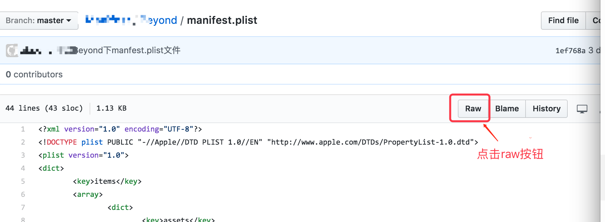

# IPA分发
iOS分发渠道目前有下面四种: AppStore、 企业包、 Testflight、 超级签名。AppStore没什么好说的，只要上架到AppStore，用户就可以通过AppStore正常下载。

## 苹果商店外的其他分发渠道
关于企业包:
```markdown
企业包 是使用企业账号进行分发，不能上架苹果商店。原来的目的是为了让一些大厂在内部使用一些APP的时候，不需要上架苹果店就可以安装。后来被广泛用于一些违规APP分发，导致企业账号很难申请。 
* 优点: 不需要通过苹果商店进行下载，用户可以通过`itms-services`的方式进行安装
* 缺点: 证书一年需要重签一次，安装之后需要信任对应的证书。有时候会掉签，证书被封的情况,在重签名的时候，对方注入一些库造成闪退从而达到对APP的使用时间限制
```

关于Testflight:
```markdown
Testflight 分内部测试和外部测试:
* 内部测试主要主要针对于开发人员内部测试需要添加对应的邮箱到开发者账号，苹果向该邮箱发送邀请码，登录TestFlight之后，使用邀请码进行下载。
* 外部测试被用于分发，可以通过邀请链接邀请用户下载，最多添加一万个测试设备，用户安装之后，从testFlight删除邀请的用户，从而达到设备无限制,目前已经苹果已经对此作出了限制

使用Testflight分发的优缺点:
* 优点: 不需要通过苹果商店进行下载，用户可以通过`Testflight`软件进行安装
* 缺点也有很多
    * 1. 有时间限制，最长90天，根据上传时间进行计算
    * 2. 苹果会对Testflight的包进行审核，如果是马甲包被查会导致主包下架
    * 3. 需要在手机中安装 TestFlight 的APP，造成一定用户安装难度
```

关于超级签名:
```markdown
能想到超级签名的人真他娘是个人才！！！[苹果无线配置文件交付和配置文档](https://developer.apple.com/library/archive/documentation/NetworkingInternet/Conceptual/iPhoneOTAConfiguration/Introduction/Introduction.html#//apple_ref/doc/uid/TP40009505-CH1-SW1)
它的原理简单的说，就是将真机测试的过程自动化。利用了苹果提供的Ad-Hoc分发通道，把这一百台安装设备当做开发设备来进行分发。流程是:获取用户设备的UDID→UDID添加到开发者后台→用已添加过的UDID的证书对IPA进行重签名→传到serve→使用`itms-services`的方式实现用户的下载。
超级签名需要用到个人或者公司的苹果开发者账号。

* 优点
    * 1. 相对稳定，因为它的原理是使用个人开发者账号，。不会像企业证书签名容易掉签问题
    * 2. 不用像企业包一样信任证书，安装后直接可以启动
    * 3. 包的有效期为1年,时间
* 缺点就是贵，真的贵，一个开发者账号99美金,一个账号最多安装100个测试设备
```


## 利用Github做IPA企业包分发
利用Github仓库分发的本质其实是利用了`itms-services://`协议做分发,plist 文件的链接要求一定是`https`的，而且必须是公网`ssl`，自签名及免费的https不可用。如果是公司内搭建测试分发平台也可以使用这种方式。自己测试可以直接使用Github仓库做分发，仓库地址本身含有https。可以分为4步:
```markdown
1. 生成企业包
2. 将文件上传到 Github 仓库, 将`manifest.plist`文件中的下载地址修改成 IPA 包和 Logo图片的具体路径
3. 生成对应的`itms-services://`协议地址,一般为`itms-services://?action=download-manifest&url=manifest.plist文件路径`
4. 在网页填写对应的链接
```

`manifest.plist`文件本身是一个 xml 文件，文件中的内容如下:
```xml
<?xml version="1.0" encoding="UTF-8"?>
<!DOCTYPE plist PUBLIC "-//Apple//DTD PLIST 1.0//EN" "http://www.apple.com/DTDs/PropertyList-1.0.dtd">
<plist version="1.0">
<dict>
	<key>items</key>
	<array>
		<dict>
			<key>assets</key>
			<array>
				<dict>
					<key>kind</key>
					<string>software-package</string>
					<key>url</key>
					<string>ipa下载地址</string>
				</dict>
				<dict>
					<key>kind</key>
					<string>display-image</string>
					<key>url</key>
					<string>57大小的图片</string>
				</dict>
				<dict>
					<key>kind</key>
					<string>full-size-image</string>
					<key>url</key>
					<string>512大小的图片</string>
				</dict>
			</array>
			<key>metadata</key>
			<dict>
				<key>bundle-identifier</key>
				<string>com.xxx.xxx</string>
				<key>bundle-version</key>
				<string>版本号</string>
				<key>kind</key>
				<string>software</string>
				<key>title</key>
				<string>APP名字</string>
			</dict>
		</dict>
	</array>
</dict>
</plist>
```


### 2.1 生成企业包
1. 在打包时勾选 `Include manifest for over-the-air installation`选项,如果不勾选就需要我们手动创建`manifest.plist`文件了

2. 填写对应的下载地址，因为目前我们还不知道上传到仓库的地址，可以随便写

3. 打包成功后会生成 IPA 和 `manifest.plist`文件


### 2.2 上传仓库
1. 将 IPA 和 manifest.plist 文件上传到Github仓库，另外需要创建 `57x57`和`512x512`的Logo图片,在安装的时候会在桌面显示对应的图标。

2. 修改文件的下载路径, 点开仓库对应的 `ipa -> 找到Download按钮 -> 右键，选择复制链接`

3. 修改`manifest.plist`文件对应的IPA 和 图片的链接地址。下图是它们要填写的地址，没有对应的key值可以手动创建

4. 找到`manifest.plist`的链接地址。点击 `manifest.plist文件 -> 点击 raw -> 跳转到新的链接`

当前网页上的地址就是`manifest.plist`文件的链接


### 2.3 itms-services 协议格式
我们使用的是`itms-services://`协议进行下载，它的格式是`itms-services://?action=download-manifest&url=manifest.plist文件路径`。

在Github仓库中我们找到了`manifest.plist`文件的真实下载地址,只要把它拼接到上面的路径就可以了。比如:
```javascript
itms-services://?action=download-manifest&url=https://raw.githubusercontent.com/chuheridangwu/company/master/manifest.plist
```

### 2.4 网页测试
我们可以简单的写一个网页,点击按钮时跳转的地址为`itms-services://`的地址，点击按钮就可以达到下载的目的了，或者直接复制URL在浏览器中打开也可以达到相同的效果。
```javascript
<!DOCTYPE html>
<html lang="en">
<head>
    <meta charset="UTF-8">
    <title>应用下载</title>
</head>
<body>
<a href="itms-services://?action=download-manifest&url=manifest.plist文件路径">点击开始安装App</a>
</body>
</html>
```

## 使用蓝奏云进行分发
IPA分发可以直接将签名过的IPA包发送到[蓝奏云网盘](https://www.lanzou.com/)，用户通过下载地址可以直接安装。必须是企业签名的IPA,非会员对包的大小有限制，需要100M以下。

## 来源
* [iOS 如何利用github进行企业应用ipa分发](https://my.oschina.net/u/2473136/blog/1550018)