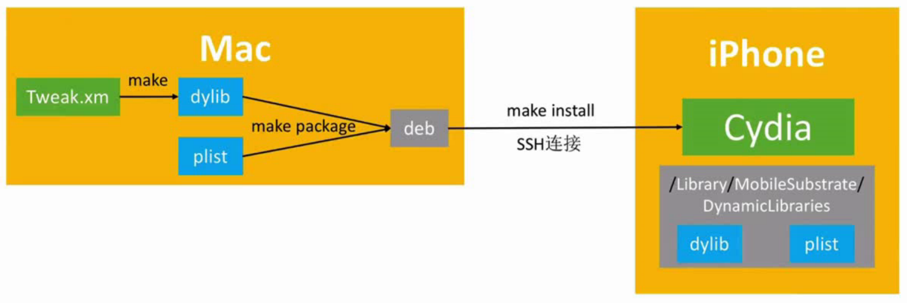

# theos
我们可以通过`theos`注入代码到APP中,在程序运行期间，替换应用原有的执行逻辑。首先需要在电脑安装 theos ,可以分为以下几步:
```markdown
1. 安装签名工具ldid `brew install ldid`
2. 修改环境变量，终端添加 theos 命令
    2.1 编辑用户的配置文件`vim ~/.bash_profile`.
    2.2 在`.bash_profile`文件后加入下面这两行代码
        export THEOS=~/theos
        export PATH=$THEOS/bin:$PATH
    2.3 让环境变量立即生效 `source ~/.bash_profile`。或者重启终端
    2.4 编辑在`~/.zshrc`文件,在最后增加一行：`source ~/.bash_profile`，这样每次电脑重启都会有效
3. 在`$THEOS`目录下载代码，也就是刚配置的`~/theos`目录 `git clone --recursive https://github.com/theos/theos.git $THEOS`。`git clone --recursive`是递归下载，会下载所有依赖的模块
```

## 创建tweak项目
1. 进入桌面,创建新的项目
    ```sehll
    cd ~/Desktop
    nic.pl   // 创建新的theos项目
    ```
2. 选择`iphone/tweak`
3. 填写项目信息
    ```markdown
    * Project Name : 项目名称
    * Package Name :  项目ID (随便写)
    * Author/Maintainer Name :  作者名称
    * [iphone/tweak] MobileSubstrate Bundle filter : 需要修改的APP的bundle ID
    * [iphone/tweak] List of applications to terminate upon installation : 回车就行 
    ```
4. 创建theos项目之后,编辑`Makefile`文件,在前面加入环境变量`THEOS_DEVICE_IP` 和 `THEOS_DEVICE_PORT`，写清楚通过哪个IP和端口访问手机。
```Makefile
    export THEOS_DEVICE_IP=127.0.0.1
    export THEOS_DEVICE_PORT=2222

    TARGET := iphone:clang:latest:7.0
    INSTALL_TARGET_PROCESSES = SpringBoard

    include $(THEOS)/makefiles/common.mk

    TWEAK_NAME = bigotweek

    bigotweek_FILES = Tweak.x
    bigotweek_CFLAGS = -fobjc-arc

    include $(THEOS_MAKE_PATH)/tweak.mk
```
如果不希望每个项目的 Makefile 文件都编写IP和端口，可以将配置添加到`~/.bash_profile`到文件中。编辑完成后，`source ~/.bash_profile`让配置生效
```shell
$ vim ~/.bash_profile
export THEOS=~/theos
export PATH=$THEOS/bin:$PATH
export THEOS_DEVICE_IP=127.0.0.1
export THEOS_DEVICE_PORT=2222
$ source ~/.bash_profile
```
5. 打开 `Tweak.xm`文件，编写对应的hook代码。
```objc
    %hook CMPopTipView
        - (id)initWithCustomView:(id)arg1{
            return nil;
        }
        - (id)initWithTitle:(id)arg1 message:(id)arg2{
            return nil;
        }
    %end
```
6. 编译 - 在theos当前目录下打包,终端输入`make`
7. 打包成deb - `make pageage`,**如果直接输入这个指令也可以编译，它内部包含了`make`**,如果需要打Release插件，使用 `make package debug=0`指令
8. 安装deb，默认会重启SpringBoard - `make install`
9. 或者将这几个命令一起写 - `make clean && make && make package && make install`

## hook应用思路
hook 别人项目时，可以按照以下的思路去做:
```markdown
1. 手机打开应用,使用`frida-ps -Ua`查看应用的Bundle ID
2. 开启端口映射，将手机通过usb连接到电脑，使用`iproxy 2222 22`进行端口映射
3. 使用`python3 dump.py -H 127.0.0.1 -p 2222 -u root -P alpine com.bigo.live`指令对应用进行脱壳
4. 使用 Reveal 对界面进行分析，找到对应的 类 和 方法。或者通过cycript进行界面分析
6. 找到类之后，通过 theos 编写对应的类，hook对应的方法。
7. 编译 `make` -> 打包 `make package` -> 安装 `make install`
```
按照这一套流程走完应该没问题，如果需要安装到未越狱的手机，需要再进行打包。后面慢慢来。

## theos的安装过程
当我们编写完代码之后,theos 的安装过程分为以下几个步骤：
```markdown
1. 调用`make`命令将代码编译成动态库，在项目下会生成隐藏文件夹`.theos/obj/debug`。
2. `make package`将动态库压缩成安装包，文件在项目下的`/packages`文件夹中。
3. 当我们运行`make install`时，会根据我们设置的`THEOS_DEVICE_IP`和`THEOS_DEVICE_PORT`远程登录手机,将deb包传递给手机，通过 Cydia 将deb安装到手机上。安装路径是`/Library/MobileSubstrate/DynamicLibraries/`文件夹中。
```
安装过程如下图所示，`MobileSubstrate`文件夹由`Cydia`进行管理。


## theos的运行过程
当我们启动软件时，dyld 加载程序的 Mach-O 文件，Cydia 会检测`MobileSubstrate`文件夹中有没有该软件对应的插件，如果有，会加载对应插件，修改软件中内存中的汇编代码，指向插件的函数。

我们可以通过汇编进行查看,写一个简单的程序，点击之后在界面上添加一个红色的view,通过 hook 点击方法,查看安装插件之后，点击界面会调用什么方法。
```objc
- (void)touchesBegan:(NSSet<UITouch *> *)touches withEvent:(UIEvent *)event{
    [self click];
}
- (void)click{
    UIView *view = [[UIView alloc] initWithFrame:CGRectMake(100, 100, 100, 100)];
    view.backgroundColor = [UIColor redColor];
    [self.view addSubview:view];
}
```

hook点击方法,在点击之后更换view的位置：
```objc
@interface ViewController
- (id)view;
@end

%hook ViewController
- (void)click{
	UIView *view = [[UIView alloc] initWithFrame:CGRectMake(200, 300, 100, 100)];
    view.backgroundColor = [UIColor redColor];
    [[self view] addSubview:view];
}
%end
```
hook前和hook后调用的方法如下图:


## theos安装时存在的问题
##### Make package出现错误
```shell
Can't locate IO/Compress/Lzma.pm in @INC (you may need to install the
IO::Compress::Lzma module) (@INC contains: /Library/Perl/5.18/darwinthread-multi-2level /Library/Perl/5.18 /Network/Library/Perl/5.18/darwinthread-multi-2level /Network/Library/Perl/5.18 /Library/Perl/Updates/5.18.2
/System/Library/Perl/5.18/darwin-thread-multi-2level
/System/Library/Perl/5.18 /System/Library/Perl/Extras/5.18/darwin-threadmulti-2level /System/Library/Perl/Extras/5.18 .) at
/Users/mj/theos/bin/dm.pl line 12.
BEGIN failed--compilation aborted at /Users/mj/theos/bin/dm.pl line 12.
make: *** [internal-package] Error 2
```

这是因为打包压缩方式有问题，改成gzip压缩就行了。
```markdown
1. 修改dm.pl文件,用#号注释掉`#use IO::Compress::Lzma; #use IO::Compress::Xz;`
2. 修改deb.mk文件第6行的压缩方式改为gzip，`_THEOS_PLATFORM_DPKG_DEB_COMPRESSION ?= gzip`。
```

##### Make的错误,错误内容是:
```shell
Error: You do not have an SDK in /Library/Developer/CommandLineTools/Platforms/iPhoneOS.platform/Developer/SDKs
```
这是因为电脑安装多个xcode导致路径错误，需要指定Xcode。` sudo xcode-select --switch /Applications/Xcode.app/Contents/Developer/`

##### 多次编译会出错，内容：
```shell
> Making all for tweak xxx…
make[2]: Nothing to be done for `internal-library-compile'.
```
这是因为之前已经编译过有缓存导致的，clean一下即可。

## theos代码编写的细节
1.使用 self 调用方法，需要前向声明。self 在此处会被认为是 id 类型，而 `numberOfSectionsInTableView:` 方法属于 `WCTableViewManager` 类的方法，如果不对 `WCTableViewManager `进行前向声明，会出现以下错误：
```objc
Tweak.x:12:18: error: receiver type 'WCTableViewManager' for instance message is a forward declaration
        if (section == [self numberOfSectionsInTableView:tableView] - 1) {
                        ^~~~
Tweak.x:24:8: note: forward declaration of class here
@class WCTableViewManager;
```
前向声明代码：
```objc
@interface WCTableViewManager
- (NSInteger)numberOfSectionsInTableView:(UITableView *)tableView;
@end
```
2.未导入了 <UIKit/UIKit.h> 编译失败，如果hook的代码有使用UIKit控件，需要配置UIKit库，不然会报以下错误：
```objc
==> Linking tweak WechatTweak (armv7)…
ld: warning: building for iOS, but linking in .tbd file (/opt/theos/vendor/lib/CydiaSubstrate.framework/CydiaSubstrate.tbd) built for iOS Simulator
Undefined symbols for architecture armv7:
  "_OBJC_CLASS_$_UIAlertController", referenced from:
      objc-class-ref in Tweak.x.ae33fabd.o
  "_OBJC_CLASS_$_UIApplication", referenced from:
      objc-class-ref in Tweak.x.ae33fabd.o
ld: symbol(s) not found for architecture armv7
clang: error: linker command failed with exit code 1 (use -v to see invocation)
```
需要在 `Makefile` 文件中，指定要导入的 `Framework`,项目名称_FRAMEWORKS ：
```objc
TARGET := iphone:clang:latest:10.0
INSTALL_TARGET_PROCESSES = SpringBoard

include $(THEOS)/makefiles/common.mk

TWEAK_NAME = WechatTweak

WechatTweak_FILES = Tweak.x
WechatTweak_CFLAGS = -fobjc-arc
WechatTweak_FRAMEWORKS = UIKit
```

## logos语法

代码 | 作用
------- | -------
`%hook xxx` | hook一个类的开始
`%end` | hook一个类的结束
`%orig` | 调用函数原来的代码逻辑
导入UIKit库 | 在`Makefile`文件中使用`项目名称_FRAMEWORKS = UIKit`
`%new` | 新添加的方法前需要使用`%new`,如果直接调用`%new`新增的方法，需要在`@interface`中声明一下
`%ctor` | 在加载动态库时调用
`%dtor` | 在程序退出时调用
`%c(className)` | 生成一个Class对象，比如%c(NSObject),类似于NSStringFromClass().
`%log` | 打印方法名和参数信息，可以通过控制台查看打印信息
`logify.pl`指令 | 将一个头文件转换成可以打印所有方法信息的xm文件，使用方式`loginfy.pl xxx.h > xxx.xm`

### logify.pl指令
`logify.pl`指令包含在`~/theos/bin`文件夹中,它的作用是将一个头文件转换成可以打印所有方法信息的xm文件。为什么我们会有这种需求呢？

我们如果需要知道在当前的界面，点击一个按钮之后，都调用了那些方法。首先需要找到当前类,将这个类的所有方法进行 hook ,然后通过`%log`打印方法信息，这样我们就能知道在使用这个类时都调用了那些方法。

但是当该类方法特别多时，那么我们一个一个手动去 hook 时，非常浪费时间且枯燥，我们可以通过`logify.pl`指令进行快速转换，使用方式是`logify.pl xxx.h > xxx.xm`。

`logify.pl`指令生成的 xm 文件，很多时候直接编译是不成功的，需要对其进行一些处理：
```markdown
* 删除 `__weak`
* 删除`inout`
* 声名类信息 `@class XXPerson;`或者将类名为替换为`void`，比如讲`XXPerson *`替换为`void *`
* 声明一下协议信息`@protocol XXTestDelegate;`或者删除协议`<XXTestDelegate>`
* 删除`-（void）.cxx_desture{%log ;%orig;}`方法
* 替换`HBLogDebug(@" = 0x%x",(unsigned int)r)`为`HBLogDebug(@" = 0x%@",r)`,删除`(unsigned int)`
```


## theos添加图片
在 theos 中添加图片资源，需要在当前目录下创建`layout`文件夹, layout 文件夹可以看做手机的根路径，我们最好将图片资源放到`layout/Library/PreferenceLoader/Preferences/xx项目名/`下，使用时根据路径进行加载,比如:
```objc
cell.imageView.image = [UIImage imageWithContentsOfFile:@"/Library/PreferenceLoader/Preferences/skull.png"];
```
为了方便使用，可以用宏定义图片路径，在OC中，字符串可以这样写:
```objc
//在OC中是字符串是支持这样的写法的
NSString *path = @"/Library/PreferenceLoader/"
                        "Preferences/xxx/"
                            "skull.png";
```
我们在编写宏定义时,根据宏定义的语法在参数面前加上一个`#`，就表示给这个参数加上一个双引号,如下
```c
// #path 会自动在path上添加双引号
#define MJFile(path) @"/Library/PreferenceLoader/Preferences/xxx/" #path
```

>如果觉得这里路径过长，也可以把图片放到`/Library/Caches`文件中

## theos 多文件开发
thoes多文件开发时，需要在`Makefile`文件中注明那些文件需要编译，并且在使用时需要导入头文件。
```makefile
TARGET := iphone:clang:latest:7.0
INSTALL_TARGET_PROCESSES = SpringBoard

include $(THEOS)/makefiles/common.mk

TWEAK_NAME = tweek_test

tweek_test_FILES = src/Tweak.x src/Person.m
tweek_test_CFLAGS = -fobjc-arc
tweek_test_FRAMEWORKS = UIKit

include $(THEOS_MAKE_PATH)/tweak.mk
```
`Tweak.x` 和 `Person.m` 在 src 文件夹中，路径需要完整的带上src。如果有多个文件需要编译，可以通过正则的方式进行编写，比如`src/*.m`，如果Tweak.x和Person不在同一文件夹中，导入时需要导入全路径。

>如果需要编译某个文件夹下的所有xm文件，格式是`tweek_test_FILES = $(wildcard src/*.xm)`,wildcard 是固定格式。

## 推荐
* [iOS Tweak修改系统行为（classdump-dyld）](https://www.jianshu.com/p/15436bdf882d)
* [iOS Tweak进阶](https://blog.6ag.cn/3414.html)
* [iOS逆向开发-theos中的Makefile](https://juejin.cn/post/6962434841392447524)

## theos示例代码
下面是对控制器的 UITableView 进行 hook 的示例代码，如果有需要遇到的问题，可以看示例代码中是都有对应的方案。
```objc
// 这里也可以使用宏定义
#define AUTO_KEY  [NSUserDefaults standardUserDefaults]
#define MJFile(path) @"/Library/PreferenceLoader/Preferences/xxx/" #path

// 如果需要使用self, 需要先声明对应的方法，再调用
@interface DSRNewMineViewController
- (long long)numberOfSectionsInTableView:(id)arg1;
@end


%hook DSRNewMineViewController

- (long long)numberOfSectionsInTableView:(id)arg1{
	return %orig + 1;
}

- (long long)tableView:(id)arg1 numberOfRowsInSection:(long long)arg2{
	if(arg2 != [self numberOfSectionsInTableView:arg1] - 1){
		return %orig;
	}
	return 2;
}

- (double)tableView:(id)arg1 heightForRowAtIndexPath:(id)arg2{
	if([arg2 section] != [self numberOfSectionsInTableView:arg1] - 1){
		return %orig;
	}
	return 44;
}

- (id)tableViewListWithTableView:(id)arg1 cellForRowAtIndexPath:(id)arg2{
   	if([arg2 section]  != [self numberOfSectionsInTableView:arg1] - 1){
		return %orig;
	}

	NSString *cellId = ([arg2 row] == 1) ? @"exitCellId" : @"autoCellId";
	UITableViewCell *cell = [arg1 
			dequeueReusableCellWithIdentifier:cellId];
	cell.imageView.image = [UIImage imageWithContentsOfFile:MJFile(skull.png)];

	if([arg2 row]  == 0 ){
		if(!cell){			
			cell =  [[UITableViewCell alloc] initWithStyle:UITableViewCellStyleDefault reuseIdentifier:cellId] ;
		}
		cell.textLabel.text = @"自动化";

		UISwitch *cellSwitch = [[UISwitch alloc] init];
    	[cellSwitch addTarget:self action:@selector(autoChange) forControlEvents:UIControlEventValueChanged];
		cellSwitch.on = [AUTO_KEY boolForKey:@"switch_key"];
		cell.accessoryView = cellSwitch;
	}
	if([arg2 row]  == 1 ){
		if(!cell){			
			cell =  [[UITableViewCell alloc] initWithStyle:UITableViewCellStyleDefault reuseIdentifier:cellId] ;
		}		cell.textLabel.text = @"点击退出";
	}
	return cell;
}

- (void)tableView:(id)arg1 didSelectRowAtIndexPath:(id)arg2{
	if([arg2 section]  != [self numberOfSectionsInTableView:arg1] - 1){
		return %orig;
	}

	if([arg2 row]  == 1 ){
		// 强制退出
		abort();
	}
}

// 新添加的方法，需要在方法前增加 %new
%new
- (void)autoChange:(UISwitch *)switchView{
	[AUTO_KEY setBool:switchView.isOn forKey:@"switch_key"];
	[AUTO_KEY synchronize];
}

%end

// 动态库加载时调用
%ctor{
    NSLog(@"------ctor------");
}

// 程序即将结束时调用
%dtor{
    NSLog(@"------ctor------");
}
```