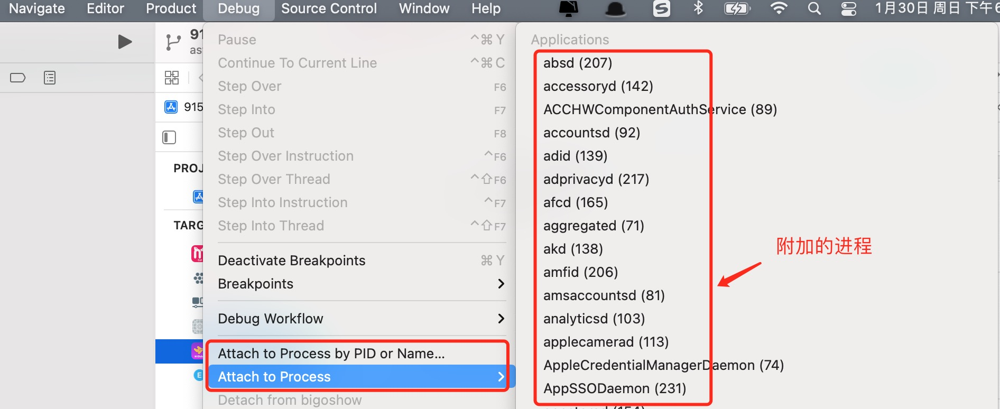

# Xcode
Xcode是iOS开发必备的开发工具，在项目中，经常会遇到各种配置和路径问题，在这里做一下讲解。

## 配置
xcode常见的一些配置，平时经常遇到找不到库、找不到头文件，可能都是这些配置导致的
```markdown
* `${SRCROOT}`：代表的是项目根目录下
* `${PROJECT_DIR}`：代表的是整个项目
* `${PROJECT_FILE_PATH}`: 表示project的当前路径，相当于$(PROJECT_DIR)/$(PROJECT_NAME).xcodeproj
* `$(PROJECT_NAME)` ： 项目名字
* `${PODS_ROOT}`  : 项目使用cocoapods，pod文件目录
* `$(inherited)`：添加目录的时候写上 “$(inherited)” 就是表示路径自己从frameworks里面读取。 默认的情况下路径配置是不被 Targets 继承的，只有当Targets的设置加入了$(inherited)时才被继承，继承来自更高一级的配置。
* `${EXECUTABLE_NAME}` : 执行程序名，默认与 PRODUCT_NAME 一致
* `${PRODUCT_NAME}` : 显示到用户屏幕上的 App 名称
* `$(PRODUCT_BUNDLE_IDENTIFIER)` : App的唯一标识 Bundle ID
```

Xcode中关于多个架构的设置，如下图：

```markdown
* `$(ARCHS_STANDARD)`: Xcode内置的环境变量，默认是`armv7` 和`arm64`
* `Excluded Architetures`:  如果项目不需要哪种架构就写上去
```

## Build Setting
设置 | 含义
------- | -------
`Framework Search Paths` | 附加到项目中的framework 的搜索路径。
`Library Search Paths` | 附加到项目中的第三方Library的搜索路径。
`Header Search Path` | 头文件的搜索路径。
`User Header Search Paths` | 只有在Always Search User Paths为Yes时才会被搜索。

## 查看汇编代码的两种方式
* 进入断点查看汇编的方式 `Debug -> Debug Workflow -> Always show Disassembly`，进入断点时会显示汇编代码
* 通过将.m文件转成汇编文件的方式 `Product -> Perform Action -> Assemble 文件名.m`,会将对应的文件转成汇编文件。如果想看具体的行号，搜索`m:行号`

## Instruments — Time Profiler使用 排查耗时代码
有时候程序在某个时间运行很慢，通过Time Profiler工具可以对耗时代码进行排查，比如我在做PK时，需要使用YY_Image加载webp动画，webp动画解码的时候特别耗时，通过`Time Profiler`工具可以直接定位到代码。
打开方式：`Instruments` -> `Time Profiler`


* `Separate by State :` 线程分离，状态分开显示 ，例如：Running状态，
* `Separate by Thread :` 线程分离, 每个线程分开显示，只有这样 才能在调用路径中能够清晰看到占用CPU耗时最大的线程.(默认勾选)
* `Invert Call Tree :` 堆栈信息显示顺序,默认是`FunA { FunB { FunC } }`,勾选后堆栈顺序是`C->B->A`
* `Hide System Libraries :` 隐藏系统调用,只关注自己代码的耗时(建议勾选，方便查看)
* `Flatten Recursion : `递归函数, 每个堆栈跟踪一个条目
* `Top Functions :` 显示某个函数的总时间，A函数内调用多个函数时，可以显示A函数的总耗时

## 设置环境变量
`Product` -> `Scheme` -> `Edit Scheme` -> `Run` -> `Environment Variables`

## 关闭ARC
选中`Build Settings`,选择 `ALL` 和 `Combined` ，搜索 `Automatic Reference Counting`，将值从YES 更改为 NO;

Xcode 提供了一个迁移工具，可以自动将MRC代码转换为ARC代码，选择 `Edit > Convert > To Objective-C ARC`

使用ARC作为默认方式的项目,可以使用`-fno-objc-arc`编译器标志为指定文件禁用ARC
使用MRC作为默认方式的项目,可以使用`-fobjc-arc`编译器标志为指定文件启用ARC

## 开启僵尸对象
`Product` -> `Scheme` -> `Edit Scheme` -> `Run` -> `Diagnostics` -> `Zombie Objects`

## 开启LinkMap
生成LinkMap条件，`Build Settings` 
 `Path to Link Map File`  LinkMap 文件保存地址
 `Write Link Map File`  开启LinkMap
可借助第三方工具解析LinkMap文件： https://github.com/huanxsd/LinkMap

## Xcode附加进程
除了用Reveal查看界面外，还可以使用Xcode附加进程的方式查看手机中的应用界面。
1. 首先需要手机打开对应的应用
2. 打开Xcode选中手机，选择`Debug -> Attach to Process -> 选择调试的应用`
3. 或者选择`Debug -> Attch to Process by PID or Name -> 输入应用的名字或者端口`,端口可以在Mac中的控制台进行查看




## 图片拉伸
图片拉伸有三种方法,使用代码或者放到项目中进行拉伸
第一种放在Assets中，选中图片之后可以通过右侧面板Slicing进行拉伸
第二种，使用代码设置保护范围，根据2x、3x设置保护不被拉伸的范围
```objc
- (UIImage *)resizableImageWithCapInsets:(UIEdgeInsets)capInsets;
// 使用方式
UIImage *image = [UIImageimageNamed:@"RedButton"];
    image = [image resizableImageWithCapInsets:UIEdgeInsetsMake(image.size.height *0.5, image.size.width *0.5, image.size.height *0.5, image.size.width *0.5)];
```

第三种，leftCapWidth: 左边不拉伸的像素，topCapHeight:上边不拉伸的像素
```
- (UIImage *)stretchableImageWithLeftCapWidth:(NSInteger)leftCapWidth topCapHeight:(NSInteger)topCapHeight__TVOS_PROHIBITED;

// 示例
UIImage *image = [UIImageimageNamed:@"RedButton"];
image = [image stretchableImageWithLeftCapWidth:image.size.width *0.5topCapHeight:image.size.height *0.5];
```

拉伸的模式有两种：
* UIImageResizingModeTile   平铺，默认是平铺
* UIImageResizingModeStretch  拉伸，

如果是需要对网络图片进行拉伸，首先将图片下载到本地，**对设备来说，网络图片就是1x图**，如果你使用过大的图片，拉伸的时候注意图片不要被压缩了。

比如你调试时，使用3x图，大小是258x111，不被拉伸的区域为上55，左120，下55，右70，控件高度是40，
当你下载网络图片之后，会发现图片被压缩，这是因为下载的图片对控件来说是1x图，控件最少的高度需要是图片的高度111才不会被压缩。你可以将图片的大小更改为86x37，这样下载好之后只会拉伸而不会被压缩。

很多时候安卓需要使用大的图片才会显示的更完美，如果需要跟安卓使用同一张图片，可以使用大图，下载之后先等比对图片进行压缩，然后再对其进行拉伸即可

## M1芯片 Xcode 关闭 Rosetta
打开访达->应用->Xcode->右键点击Xcode->显示简介->勾选使用Rosetta 打开，关闭Xcode，重新打开。 现在可以正常打包了

## LLDB查看寄存器和汇编地址

含义 | 指令 
------- | ------- 
读取寄存器的值 |  `register read 寄存器名称`,例如`register read rax`
修改寄存器的值 |  `register write 寄存器名称 数值`,例如`register write rax 10`
读取内存中的值 |  `x/数量-格式-字节大小 内存地址`,例如 `x/3xw 0x0000010`
读取内存中的值 |  `memory read 数量格式字节数 内存地址`,例如 `memory read/3xg 0x100552c00`
修改内存中的值 |  `memory write 内存地址 数值`,例如`memory write 0x0000010 10`

在读取内存中的值对应的3xw含义：
```markdown
3: 代表打印的数量
x: 代表显示的格式 x->以16进制显示,   f->浮点数,  d->十进制
w: 代表字节数   b->byte 1个字节,  h ->half word 2字节,  w ->word 4字节, g ->giant word 8字节
```

## 编译器优化
Xcode中设置debug模式和release模式编译出来的汇编是不一样的，这是因为Release模式开启了编译器优化，选择`Target -> Build Settings`,搜索 `Optimization Level`。