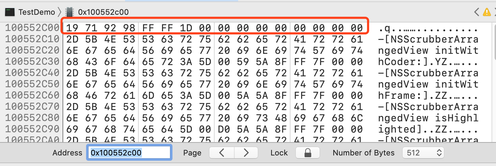
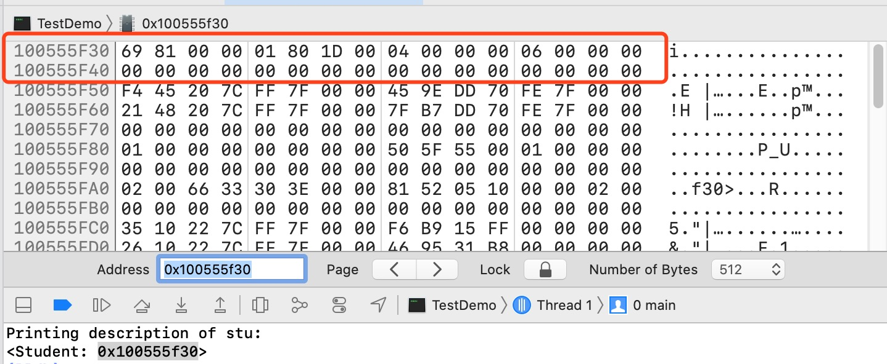

# OC对象的本质
我们如何验证我们的说法是正确的，将通过以下几个方式去验证
1. 先将代码转换成`c++`代码，查看转换成之后oc对象是什么样子（这种方式会在以后经常用到）
2. 通过runtime的`class_getInstanceSize()函数`和 malloc的`malloc_size()函数`查看一个对象在内存中占多少字节
3. 通过苹果官网的`runtime`源码查看对象的内存是如何分配的
4. 通过xcode工具查看对象在内存中的地址，通过LLDB工具直接更改内存的值来更改对象属性的值
5. 将自定义的Student类转换成结构体，查看是怎么分配内存的

## 将代码转换成c++代码，查看oc对象 
代码的编译过程`Objective-c ->  C/C++  -> 汇编语言 ->机器语言`,如果要转换成对应的c++代码，需要使用到clang命令。`clang -rewrite-objc main.m -o main.cpp`,由于不同平台支持的代码不一样，我们只需要转在iOS平台上的C++代码就可以了。

```
xcrun -sdk iphoneos14.1 clang -arch arm64  -rewrite-objc main.m -o main.cpp
或者
xcrun -sdk iphoneos clang -arch arm64  -rewrite-objc main.m    //输出文件默认使用当前的文件名

xcrun: xcode工具运行 
-sdk -iphoneos14.1 : iphoneos14.1的sdk 
-arch : 架构 (模拟器:i386 /32位:armv7 /64位:arm64)
```

**报错**
1. 报错 xcodebuild: error: SDK "iphones" cannot be located.
 
原因是xcode命令行找不到 iphones的sdk,
`xcodebuild -showsdks` : 查看所有可用sdk

>转换成c++之后的代码，对照之前的NSObject类,会发现有同样的isa指针

```cpp
// NSObject   结构体的内存地址是它第一个成员的内存地址
struct NSObject_IMPL {
	Class isa;
};

// NSObject 定义
@interface NSObject {
    Class isa  ;
}

// Class是一个指向结构体的指针 （指针占用多少字节 64位：8个字节  32位：4个字节） 
typedef struct objc_class *Class; 
```

## 利用runtime 和  malloc 查看内存大小

通过对比`class_getInstanceSize()函数`和`malloc_size()函数`获取的内存大小，发现同样一个NSObject实例对象,获得的内存大小是不一样的。

之所以会有这样的结果，是因为`class_getInstanceSize()函数`获取的是实例对象成员变量所占用的内存，而`malloc_size()函数`获取的是实际的分配内存。我们通过查看苹果的源码做进一步的验证

```objc
#import <objc/runtime.h>
#import <malloc/malloc.h>

int main(int argc, const char * argv[]) {
    @autoreleasepool {
        NSObject *obj = [[NSObject alloc] init];

        // 获取NSObject类实例对象的成员变量所占用的大小 >> 8
        NSLog(@"%zd",class_getInstanceSize([obj class]));

        // 获取obj指针指向内存的大小，也就是实际分配的内存 >> 16
        NSLog(@"%zd",malloc_size((__bridge const void*)obj));
    }
    return 0;
}
```

##  查看苹果源码

[点击查看苹果源码地址](https://opensource.apple.com/tarballs/),搜索 objc ,下载最新的 runtime 源码，下面源码片段是`objc4-781`,搜索`class_getInstanceSize`,在 objc-class.mm 文件中发现以下函数
 
```cpp
size_t class_getInstanceSize(Class cls)
{
    if (!cls) return 0;
    return cls->alignedInstanceSize();
}

 // 返回内存对齐后的类成员变量的大小
uint32_t alignedInstanceSize() {
     return word_align(unalignedInstanceSize());
} 
```

`malloc_size()`本质调用的是`allocWithZone()`这个函数,搜索`allocWithZone`,在 NSObject.mm 文件中搜索对应方法的实现。一步步的往下找，发现在分配内存的函数`size_t instanceSize(size_t extraBytes) const `中规定，如果内存大小不到16个字节，分配16个字节

```cpp
// NSObject.mm
+ (id)allocWithZone:(struct _NSZone *)zone {
    return _objc_rootAllocWithZone(self, (malloc_zone_t *)zone);
}

// objc-runtime-new.mm
id
_objc_rootAllocWithZone(Class cls, malloc_zone_t *zone __unused)
{
    // allocWithZone under __OBJC2__ ignores the zone parameter
    return _class_createInstanceFromZone(cls, 0, nil,
                                         OBJECT_CONSTRUCT_CALL_BADALLOC);
}

// objc-runtime-new.mm
static ALWAYS_INLINE id
_class_createInstanceFromZone(Class cls, size_t extraBytes, void *zone,
                              int construct_flags = OBJECT_CONSTRUCT_NONE,
                              bool cxxConstruct = true,
                              size_t *outAllocatedSize = nil)
{
    ASSERT(cls->isRealized());

    // Read class's info bits all at once for performance
    bool hasCxxCtor = cxxConstruct && cls->hasCxxCtor();
    bool hasCxxDtor = cls->hasCxxDtor();
    bool fast = cls->canAllocNonpointer();
    size_t size;

    size = cls->instanceSize(extraBytes);
    if (outAllocatedSize) *outAllocatedSize = size;

    id obj;
    if (zone) {
        obj = (id)malloc_zone_calloc((malloc_zone_t *)zone, 1, size);
    } else {
        obj = (id)calloc(1, size);
    }
    if (slowpath(!obj)) {
        if (construct_flags & OBJECT_CONSTRUCT_CALL_BADALLOC) {
            return _objc_callBadAllocHandler(cls);
        }
        return nil;
    }

    if (!zone && fast) {
        obj->initInstanceIsa(cls, hasCxxDtor);
    } else {
        // Use raw pointer isa on the assumption that they might be
        // doing something weird with the zone or RR.
        obj->initIsa(cls);
    }

    if (fastpath(!hasCxxCtor)) {
        return obj;
    }

    construct_flags |= OBJECT_CONSTRUCT_FREE_ONFAILURE;
    return object_cxxConstructFromClass(obj, cls, construct_flags);
}

// objc-runtime-new.mm 分配内存,这里规定如果内存小于16，分配16个字节
size_t instanceSize(size_t extraBytes) const {
    if (fastpath(cache.hasFastInstanceSize(extraBytes))) {
        return cache.fastInstanceSize(extraBytes);
    }

    size_t size = alignedInstanceSize() + extraBytes;
    // CF requires all objects be at least 16 bytes.
    if (size < 16) size = 16;
    return size;
}
```
**也就是说，分配给NSObject对象16个字节，它真正使用的只有8个字节。**

## 通过Xcode调试看内存地址
打开Xcode开发工具,选择 `Debug -> Debug Workflow -> View Memory`,在输入框内输入实例对象的地址。
 
 
内存地址是以16进制的的形式显示的，2个十六进制位等于一个字节。我们数一下，前7个字节是有值的，8-16地址存储的都是0，到 0x0x100552c10 这个字节才开始有新的存储值，基本可以判断这是一块连续的内存。也从侧面也证明了我们的判断。**当然不能就以这样的猜想显示为准，还是要看具体的代码实现。**
* 一个字节 = 8个二进制位
* 一个16进制位 = 4个二进制位 （2x2x2x2）
* 两个16进制位 = 一个字节

> 题外话：也可以使用LLDB命令读取内存地址

```
memory read 数量格式字节数 内存地址
memory read/3xg 0x100552c00

memory read 可以用x 表示,比如 x/3xw 0x100552c00
x/数量 格式 字节数 内存地址

3: 代表打印的数量
x: 代表显示的格式 x->以16进制显示,   f->浮点数,  d->十进制
w: 代表字节数   b->byte 1个字节,  h ->half word 2字节,  w ->word 4字节, g ->giant word 8字节

3xw可以忽略不写，直接使用  x  0x100552c00

memory write 内存地址 更改的值
memory write 0x100552c07 9

memory write: 可以直接更改某个字节的值，比如我们想改图中1D后面的一个字节，第一个字节从0x100552c00开始数
memory write 0x100552c07 9

```

## 通过自定义类确认分配的内存大小 
我们自定义一个 Student 类，给它三个属性，通过 clang 命令转换成对应的 C++ 代码，发现 Student 类会被转成 Student_IMPL 结构体。Student_IMPL 结构体内部又引用着 NSObject_IMPL 结构体，这是因为 Student 类继承自NSObject。

```objc
// 转换成c++代码之后的NSObject
struct NSObject_IMPL {
	Class isa;
};

// 转换成c++代码之后的Student
struct Student_IMPL {
	struct NSObject_IMPL NSObject_IVARS;
	int _age;
	int _no;
	int _lesson;
};

// 定义的Student类
@interface Student : NSObject{
    @public
    int _age;
    int _no;
    int _lesson;
}
@end

@implementation Student

@end

int main(int argc, const char * argv[]) {
    @autoreleasepool {
        Student *stu = [[Student alloc] init];
        stu->_age = 4;
        stu->_no = 6;
        struct Student_IMPL *impl = (__bridge struct Student_IMPL *)stu;
        NSLog(@"age = %d,no = %d",impl->_age,impl->_no);
    }
    return 0;
}
```

我们通过把 Student类 强转成对应的Student_IMPL结构体，发现依然可以获取到 age 的值。说明oc对象在编译的时候，能够成功转成对应的结构体。

另一方面我们也可以通过xcode工具查看对应的内存情况,会看到对应的_age和_no的值。说明我们的转换是没有问题的。因为iOS是小端模式,地址是从高地址开始读取,存储的真实的值是0x00000006,并不是0x60000000。


你会发现根据图片的显示，系统好像分配了32个字节的内存给我们。通过`malloc_size()`做进一步验证，发现确实分配了32个字节,我们再通过`class_getInstanceSize`方法发现返回的是24个字节。这就有点问题了，如果按照 Student_IMPL 结构体的内存对齐情况，应该是分配结构体内最大成员的倍数，也就是8个字节的倍数给我们，应该是24个字节才对。**但是为什么会分配36个字节呢？** ,原因是苹果在分配内存的时候也有内存对齐的概念，并不是你给它多少字节它就会分配多少字节出来。**苹果默认的内存对齐是以16个字节为标准**。

## 扩展知识
* **内存对齐：** 结构体的最终大小必须是最大成员的倍数。(只是内存对齐概念的其中之一)

* **Clang:** Clang是一个C语言、C++、Objective-C语言的轻量级编译器

* **malloc**： malloc的全称是memory allocation，中文叫动态内存分配，用于申请一块连续的指定大小的内存块区域以void*类型返回分配的内存区域地址，当无法知道内存具体位置的时候，想要绑定真正的内存空间，就需要用到动态的分配内存，且分配的大小就是程序要求的大小。
* **calloc:** 在内存的动态存储区中分配n个长度为size的连续空间，函数返回一个指向分配起始地址的指针；如果分配不成功，返回NULL。


* **大小端模式:**
将一个多位数的低位放在较小的地址处，高位放在较大的地址处，则称**小端序**；反之则称**大端序**
比如一个int类型，位于地址0x100处，它的值为0x01234567，地址范围为0x100~0x103字节，其内部排列顺序依赖于机器的类型。

大端法从首位开始将是：0x100: 0x01, 0x101: 0x23,0x102: 0x 45,0x103: 0x67。

而小端法将是：0x100: 0x67, 0x101: 0x45,0x102: 0x23, 0x103: 0x01。

## 面试题
**面试题：一个NSObject对象占用多少内存？**

系统分配了16个字节给NSObject对象（通过`malloc_size函数`获得）,但NSObject对象内部只使用了8个字节的空间（64bit环境下，可以通过`class_getInstanceSize函数`获得）