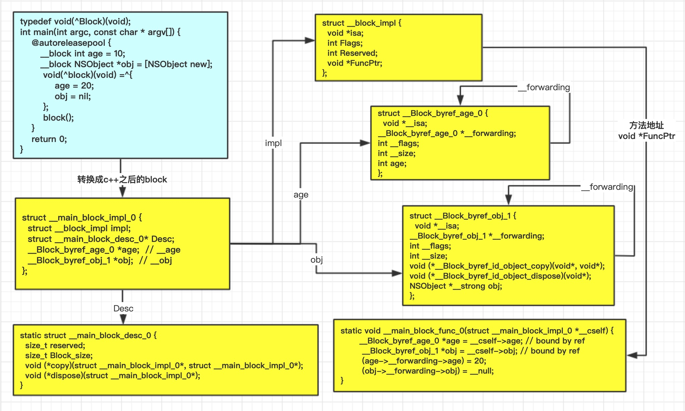
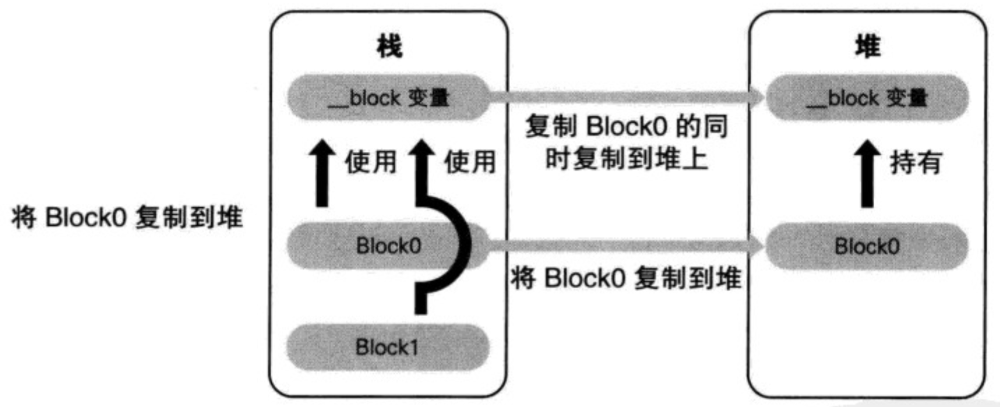
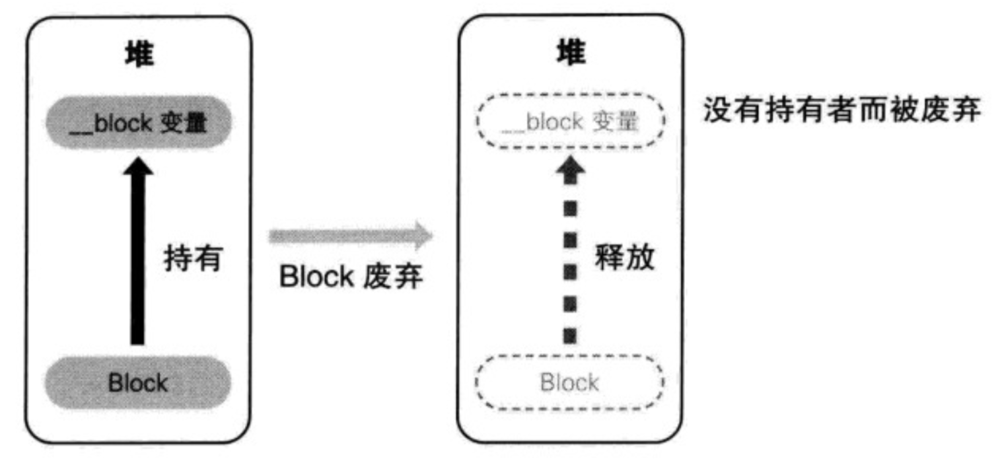
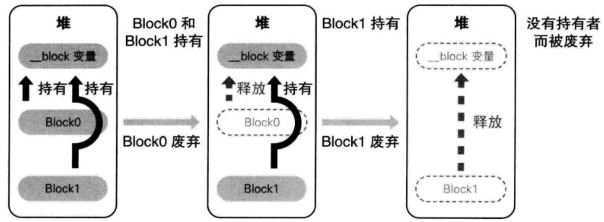
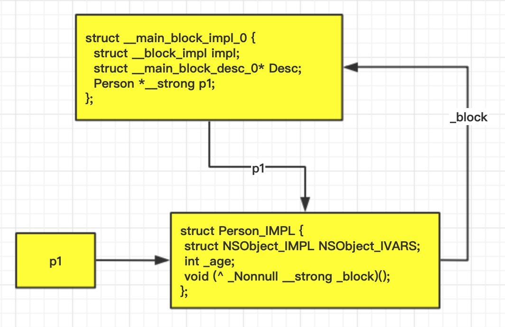
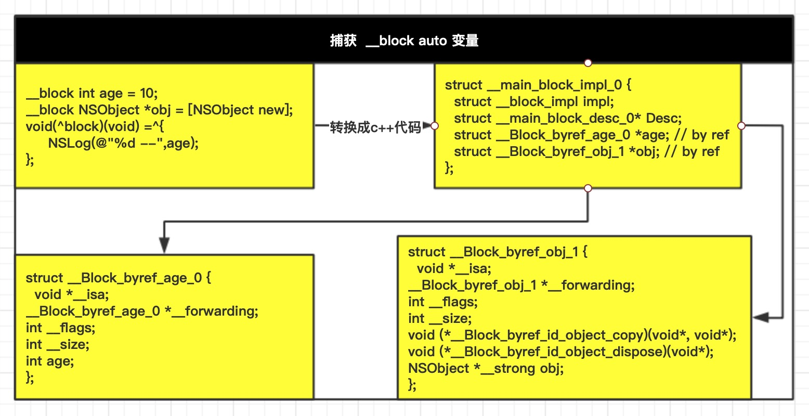
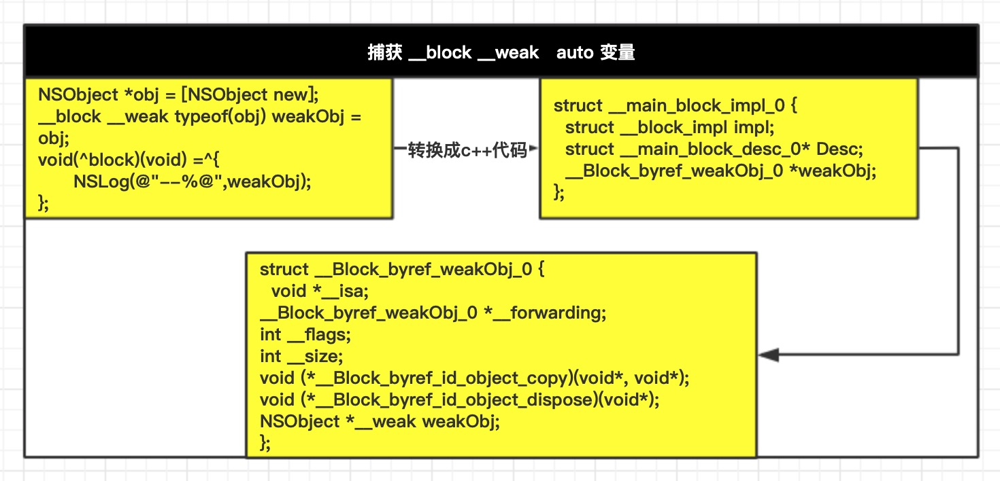
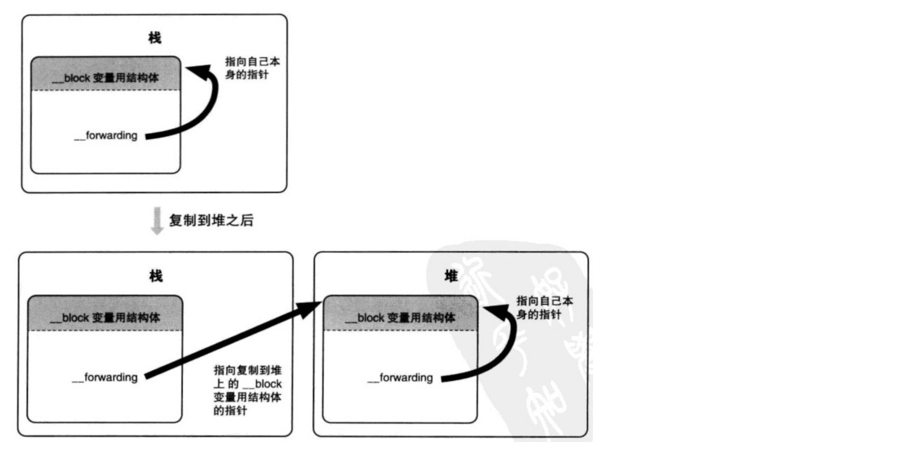

# Block

通过刚才的学习，我们知道了`Block的内部结构`、`Block的变量捕获机制`、`Block的类型和不同类型的Block捕获不同变量之间的差异`。我们刚才一直使用的是Block捕获 基本数据类型 的auto变量，如果Block捕获 对象类型 的auto变量会有什么差异呢？

## 对象类型的auto变量
我们都知道auto变量是存放在栈上的，如果Block捕获的是一个对象类型的auto变量，这个对象又会在什么时候释放呢？通过下面的代码进行一下测试：
```objc
typedef void(^Block)(void);
int main(int argc, const char * argv[]) {
    @autoreleasepool {
        Block block;
        {
            Person *person = [Person new];
            block = ^{
                NSLog(@"age: %d",person.age);
            };
        }
        block();
    }
    return 0;
}
```
**重写Person的`dealloc`方法，当person释放时，控制台会打印结果。经过测试发现：**
* 在ARC环境下如果当person没有被Block捕获时，会在Block调用之前被释放，而当它被Block捕获后，Block内部会有指针指向person对象，在Block释放的时候才会释放。
* 在MRC环境下，只有在Block调用copy方法之后person才会在Block释放的时候释放。

根据我们之前学Block类知识，**引用了auto变量的Block是`__NSStackBlock__`类型，存放在内存中的栈段，这部分内存分配、释放是由系统控制，当`__NSStackBlock__`类型的Block调用copy方法之后，会变成`__NSMallocBlock__`类型，存放在堆中。在ARC环境中，系统会根据情况自己帮我们调用copy方法，所以才会出现这种情况。**

巩固完之前所学的知识，继续猜想，为什么只有Block释放的时候person对象才会被释放呢？会不会Block内部有一个指针指向外部的person对象，我们通过clang转换oc的代码。

```cpp
// 转换之后的blck结构体
struct __main_block_impl_0 {
  struct __block_impl impl;
  struct __main_block_desc_0* Desc;
  Person *person;
};
// block的描述信息
static struct __main_block_desc_0 {
  size_t reserved;
  size_t Block_size;
  //对应__main_block_copy_0方法，引用person对象
  void (*copy)(struct __main_block_impl_0*, struct __main_block_impl_0*);
  // 对应 __main_block_dispose_0, 释放block内用的person对象
  void (*dispose)(struct __main_block_impl_0*);
} 

// __main_block_impl_0 结构体初始化的代码
 void(*block)(void) = ((void (*)())&__main_block_impl_0((void *)__main_block_func_0, &__main_block_desc_0_DATA, person, 570425344));
```
通过观看上面的代码得知，Block内部确实会创建一个指针指向外部的person对象,`__main_block_desc_0`内部也比之前多了copy和dispose两个方法，这也是为什么只有Block释放之后person才会被释放的原因，因为Block内部有引用这person。

如果我们使用弱引用呢？
```objc
Block block;
{
    Person *person = [Person new];
    __weak auto Person *weakPerson = person;
    block = ^{
        NSLog(@"age: %d",weakPerson.age);
    };
}
block();
```
当我们使用弱引用时，person在Block调用前就会被释放了，这又是为什么呢？我们转c++代码看一下Block内部的结构。使用时命令好像出了问题。报`cannot create __weak reference in file using manual reference`错误，这是因为要指定运行时系统版本，比如`xcrun -sdk iphoneos clang -arch arm64 -rewrite-objc -fobjc-arc -fobjc-runtime=ios-8.0.0 main.m`
```cpp
struct __main_block_impl_0 {
  struct __block_impl impl;
  struct __main_block_desc_0* Desc;
  Person *__weak weakPerson;
};
```
Block内部对person使用的也是弱引用，这也是为什么person会在Block调用之前释放的原因了。
### 关于Block捕获对象类型的auto变量总结：
> * 如果Block是在栈上，将不会对auto变量产生强引用
> 
> * 如果Block被拷贝到堆上->会调用Block内部的copy函数->copy函数内部会调用`_Block_object_assign`函数->`_Block_object_assign`函数会根据auto变量的修饰符`（__strong、__weak、__unsafe_unretained）`做出相应的操作，形成强引用（retain）或者弱引用,（注意：这里仅限于ARC时会retain，MRC时不会retain）
> 
> * 如果Block从堆上移除->会调用Block内部的dispose函数->dispose函数内部会调用`_Block_object_dispose`函数->`_Block_object_dispose`函数会自动释放引用的auto变量（release）

## __block的本质
在Block中，我们更多的时候需要修改捕获变量的值，这个时候你会发现，系统不允许我们在Block内部修改auto变量的值，提示我们要在auto变量前加`__block`才可以。 而修改 static 或者 全局变量 时则不会有这种提示。

这是因为**auto变量在栈上，随时会被系统回收掉的，而Block经过copy操作，内存是在堆里。所以系统不允许在Block内部直接修改auto变量的值**。

那为什么经过`__block`修饰之后auto变量就可以在Block内部被修改了呢？我们通过转换oc代码观察一下,因为这里我们用到了runtime的代码，所以需要在命令中指定runtime的版本

`xcrun -sdk iphoneos clang -arch arm64 -rewrite-objc -fobjc-arc -fobjc-runtime=ios-8.0.0 main.m`

我们转过c++代码之后发现，经过`__block`修改过的变量，会被编译器包装成一个新的对象，在Block内部被引用。而之前没有经过`__block`修饰在Block内部捕获它时，仅仅是拷贝它的值到堆上。结构体的关系如下图：

我们通过强转的方式查看一下`__main_block_impl_0`这个结构体是否正确。
```objc
struct __main_block_desc_0 {
  size_t reserved;
  size_t Block_size;
  void (*copy)(void);
  void (*dispose)(void);
};
// age对象
struct __Block_byref_age_0 {
 void *__isa;
 struct __Block_byref_age_0 *__forwarding;
 int __flags;
 int __size;
 int age;
};
// obj对象
struct __Block_byref_obj_1 {
  void *__isa;
  struct __Block_byref_obj_1 *__forwarding;
 int __flags;
 int __size;
 void (*__Block_byref_id_object_copy)(void*, void*);
 void (*__Block_byref_id_object_dispose)(void*);
 NSObject *__strong obj;
};
// block
struct __block_impl {
  void *isa;
  int Flags;
  int Reserved;
  void *FuncPtr; //block封装的方法地址
};
struct __main_block_impl_0 {
  struct __block_impl impl;
  struct __main_block_desc_0* Desc;
  struct __Block_byref_age_0 *age; // by ref
struct __Block_byref_obj_1 *obj; // by ref
};

int main(int argc, const char * argv[]) {
    @autoreleasepool {
       __block int age = 10;
       __block NSObject *obj = [NSObject new];
        void(^block)(void) =^{
            age = 20;
            obj = nil;
        };
        struct __main_block_impl_0 *block_impl = (__bridge struct __main_block_impl_0*)block;
        NSLog(@"%p ---%p",&(block_impl->age->__forwarding->age),&age);
    }
    return 0;
}
// 打印结果：0x10055d438 ---0x10055d438
```
将Block强转成`__main_block_impl_0`结构体指针之后，依然可以获取到age的值，证明我们上面说的话是正确的，并且这里注意：**经过__block修饰之后，在之后的代码中再使用age时，使用的是block内部指向的age。**在上面的代码中我们通过打印地址已经确认了。

## __block的内存管理
我们知道了当变量使用`__block`进行修饰之后，会将`__block变量`包装成一个对象在Block内部通过指针引用。这个时候变量的内存是如何管理的呢？它是在什么时候释放呢？

>Block内部持有__block变量时

* **当block在栈上时，并不会对__block变量产生强引用**
* **当block被copy到堆时**
  1. 会调用block内部的copy函数
  2. copy函数内部会调用`_Block_object_assign`函数
  3. `_Block_object_assign`函数会对`__bloc`k变量形成强引用（retain）（注意：这里仅限于ARC时会retain，MRC时不会retain）

通过下面这张图来认识一下：


`__block变量`同时被 Block0 和 Block1 引用，当 Block0 调用 copy 到堆上时，复制 Block0 的同时会把`__block变量`也复制到堆上，并且 Block0 内部持有`__block变量`。

当 block1 复制到堆上时，因为`__block变量`已经在堆上了，所以并不会再次复制。如下图：


>Block内部释放时
1. 会调用block内部的`dispose`函数
2. `dispose`函数内部会调用`_Block_object_dispose`函数
3. `_Block_object_dispose`函数会自动释放引用的__block变量（release）

只有一个Block持有`__block变量`时，只要Block被释放，`__block变量`也会被释放。


当多个Block持有`__block变量`时，只有Block全部被释放之后，`__block变量`才会被释放。


## 循环引用问题
通过上面的学习，我们已经了解了这么多的知识，应该能知道为什么会有循环引用的问题？通过下面的代码一下：
```objc
int main(int argc, const char * argv[]) {
    @autoreleasepool {
        Person *p1 = [Person new];
        p1.age = 10;
        p1.block = ^{
            NSLog(@"----%d",p1.age);
        };
        p1.block();
    }
    return 0;
}
```
它们内部的引用关系如图：


Person内部有强指针引用着Block，Block内部有强指针引用着Person对象，只要将其中一方的指针设置弱指针就可以解决循环引用了。

>如何解决循环引用的问题

* `__weak:`不会产生强引用，指向的对象销毁时，会自动让指针置为nil
* `__unsafe_unretained:`不会产生强引用，不安全。指向的对象销毁时，指针存储的地址值不变。(不建议用)
* `__block:`使用它解决循环引用的问题有两个前提，第一：block一定要调用，第二：block内部一定要把修改的变量置为nil，这样才能防止循环引用问题。（不建议用，这里只是提供思路）

**__block解除循环引用的代码**
```objc
int main(int argc, const char * argv[]) {
    @autoreleasepool {
        Person *p1 = [Person new];
        p1.age = 10;
        __block typeof(p1) weakP2 = p1;
        p1.block = ^{
            NSLog(@"----%d",weakP2.age);
            weakP2 = nil;
        };
        p1.block();
    }
    return 0;
}
```

## Block捕获不同修饰变量时的结构体
* 捕获 auto 变量

* 捕获`__weak` auto变量

* 捕获`__block` auto变量

* 捕获`__block __weak` auto变量


## 扩展知识
**为什么要把`__forwarding`指针设计成指向自己？**

通过上面的学习我们知道，当使用`__block`修饰变量时，系统会将变量包装成一个对象，在对象内有拥有`__forwarding`指针指向自己。我们先通过下面的代码来看一下：

```cpp
// block方法
__block int age = 10;
void(^block)(void) =^{
    NSLog(@" --%d",age);
};

struct __main_block_impl_0 {
  struct __block_impl impl;
  struct __main_block_desc_0* Desc;
  __Block_byref_age_0 *age; // by ref
};
struct __Block_byref_age_0 {
  void *__isa;
__Block_byref_age_0 *__forwarding;
 int __flags;
 int __size;
 int age;
};
static void __main_block_func_0(struct __main_block_impl_0 *__cself) {
__Block_byref_age_0 *age = __cself->age; // bound by ref
    //通过age->__forwarding指针，然后再知道age
      NSLog((NSString *)&__NSConstantStringImpl__var_folders_lq_035f13253jg7rg4pbw518q440000gn_T_main_856dff_mi_0,(age->__forwarding->age));
  }
```
我们看到系统会把`__block int age = 10;`修改成`__Block_byref_age_0`结构体，在结构体内部有`__Block_byref_age_0 *__forwarding;`指针指向自己，为什么要这样设计呢？

主要原因是刚开始的时候，`__block变量`有可能是在栈上的，当`__block变量`被拷贝到堆上的时候，它会让内部`__forwarding`指针指向堆上对象，而堆上`__Block_byref_age_0`结构体内部的`__forwarding`指针指向的还是堆上的自己。如下图：

这样做的好处是，通过__block修饰过变量，如果之后再使用变量的值，栈上的指针通过`__forwarding`指针获取的是堆上的age变量。这也是为什么我们使用__block修改过变量之后，之后再次使用变量时使用的是block内部指向的变量。

