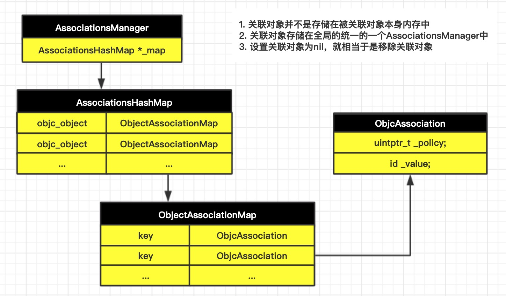

# Category之关联对象
当我们给类添加成员变量时`@property (nonatomic, assign)int age;`，系统会自动帮我们生成`setAge:`和`age`方法，当我们使用这样的方式给分类添加成员变量，调用的时候发现系统会提示我们找不到`setKey:`方法。这是因为在分类中添加成员变量，系统并不会帮我们生成对应的方法。我们在观察分类的`struct category_t`结构体时，也发现并没有数组存储成员变量，那么如果我们特别想在分类添加成员变量应该怎么做呢？

## 使用关联对象
因为分类底层结构的限制，不能添加成员变量到分类中。但可以通过关联对象来间接实现，常用api方法：
```cpp
添加关联对象 
objc->需要关联的对象  key->根据key来获取存储的值  value->存储的值  policy->成员变量的修饰词 copy assign这些 
void objc_setAssociatedObject(id object, const void * key,
                                id value, objc_AssociationPolicy policy)
获得关联对象
id objc_getAssociatedObject(id object, const void * key)

移除所有的关联对象
void objc_removeAssociatedObjects(id object)
```
objc_AssociationPolicy | 对应的修饰符
------- | -------
OBJC_ASSOCIATION_ASSIGN | assign
OBJC_ASSOCIATION_RETAIN_NONATOMIC | strong, nonatomic
OBJC_ASSOCIATION_COPY_NONATOMIC | copy, nonatomic
OBJC_ASSOCIATION_RETAIN | strong, atomic
OBJC_ASSOCIATION_COPY | copy, atomic

关联对象的代码
```objc
#import <objc/runtime.h>

@implementation Person (Run)

- (void)setName:(NSString *)name{
    objc_setAssociatedObject(self, @selector(name), name, OBJC_ASSOCIATION_COPY_NONATOMIC);
}
-(NSString *)name{
    return  objc_getAssociatedObject(self, _cmd);
}
@end
```
* **key** 只要传一个`void *`类型的参数就可以了，这里使用`@selector(name)`当做key，使用它的好处，一个是因为它在内存中只有一份，另一个是它有提示，不用再定义全局变量，还有一个好处是写代码时有提示。
* **_cmd** 就是方法的方法名，在get方法中`_cmd == @selector(name)`。每个方法系统都会传递每个隐式参数，一个是self，另一个就是_cmd，`-(NSString *)name;`类似于`-(NSString *)name:(id)self _cmd:(SEL)_cmd;`

## 关联对象的原理
通过`objc_setAssociatedObject`关联对象确实可以实现添加成员变量的需求，这个时候我们会不会有一个疑问，这个属性是添加到什么地方呢，会跟方法列表一样合并到类信息这个结构体中吗？这个时候我们就要通过runtime源码来观察。

我们从读和取两个方面来看，在源码中搜索`objc_setAssociatedObject` 和 `objc_getAssociatedObject`两个函数，代码片段来自`objc4-781`
```cpp
// 关联对象方法具体实现
void
_object_set_associative_reference(id object, const void *key, id value, uintptr_t policy)
{
    ...

    {
        AssociationsManager manager;
        AssociationsHashMap &associations(manager.get());

        if (value) {
            auto refs_result = associations.try_emplace(disguised, ObjectAssociationMap{});
            if (refs_result.second) {
                /* it's the first association we make */
                object->setHasAssociatedObjects();
            }

            /* establish or replace the association */
            auto &refs = refs_result.first->second;
            auto result = refs.try_emplace(key, std::move(association));
            if (!result.second) {
                association.swap(result.first->second);
            }
        } else {
            auto refs_it = associations.find(disguised);
            if (refs_it != associations.end()) {
                auto &refs = refs_it->second;
                auto it = refs.find(key);
                if (it != refs.end()) {
                    association.swap(it->second);
                    refs.erase(it);
                    if (refs.size() == 0) {
                        associations.erase(refs_it);

                    }
                }
            }
        }
    }
    ...
}

static void
_base_objc_setAssociatedObject(id object, const void *key, id value, objc_AssociationPolicy policy)
{
  _object_set_associative_reference(object, key, value, policy);
}

// 设置 SetAssocHook，SetAssocHook中存储的是 _base_objc_setAssociatedObject函数
static ChainedHookFunction<objc_hook_setAssociatedObject> SetAssocHook{_base_objc_setAssociatedObject};

// 通过SetAssocHook进行设置
void
objc_setAssociatedObject(id object, const void *key, id value, objc_AssociationPolicy policy)
{
    SetAssocHook.get()(object, key, value, policy);
}
```
`objc_getAssociatedObject`函数
```cpp
// 根据对象和key返回存储的值
id
objc_getAssociatedObject(id object, const void *key)
{
    return _object_get_associative_reference(object, key);
}

id
_object_get_associative_reference(id object, const void *key)
{
    ObjcAssociation association{};

    {
        AssociationsManager manager;
        AssociationsHashMap &associations(manager.get());
        AssociationsHashMap::iterator i = associations.find((objc_object *)object);
        if (i != associations.end()) {
            ObjectAssociationMap &refs = i->second;
            ObjectAssociationMap::iterator j = refs.find(key);
            if (j != refs.end()) {
                association = j->second;
                association.retainReturnedValue();
            }
        }
    }

    return association.autoreleaseReturnedValue();
}
```
通过上面的代码观察到这几个类，`AssociationsManager`、`AssociationsHashMap`、`ObjectAssociationMap`、`ObjcAssociation`,它们之间的关系如下图：

可以得出的结论是：**关联对象并不是存储在被关联对象本身的内存中，统一被`AssociationsManager`管理，当设置关联对象为nil，相当于移除关联对象**

## 面试题
**面试题1: Category的实现原理**

Category 编译之后的底层结构是`struct category_t`结构体，里面存储着`分类的对象方法、类方法、属性、协议信息。`
在程序运行的时候，runtime 会将 Category的数据，合并到类信息中（类对象、元类对象中）

**面试题2: Category和Class Extension的区别是什么？**

* Class Extension在编译的时候，它的数据就已经包含在类信息中
* Category 是在运行时，才会将数据合并到类信息中

**面试题3: Category中有load方法吗？load方法是什么时候调用的？load 方法能继承吗？**

* 有load方法
* load方法在runtime加载类、分类的时候调用
* load方法可以继承，但是一般情况下不会主动去调用load方法，都是让系统自动调用

**面试题4: load、initialize方法的区别什么？它们在category中的调用的顺序？以及出现继承时他们之间的调用过程？**

* 调用方式: 
  * load是根据函数地址直接调用
  * initialize是通过objc_msgSend进行调用的
* 调用时刻:
  * load是runtime加载类、分类的时候调用(只会调用一次)
  * initialize是类第一次接收到消息的时候调用，每个类只会initialize一次（父类initualize在子类没有实现时会被调用多次）
* 调用顺序：
  *  load:
     1. 先调用类load方法(谁先编译，谁被优先先调用),调用子类的load之前，会先调用父类的load
     2. 再调用分类的load(谁先编译，谁被优先先调用) 
  *  initialize方法：
     1. 先初始化父类的initialize方法
     2. 再初始化子类的initialize方法 （如果子类不实现，可能最终调用的是父类的initialize方法）

**面试题5: Category能否添加成员变量？如果可以，如何给Category添加成员变量？**

不能直接给Category添加成员变量，但是可以通过runtime方法间接实现Category有成员变量的效果，关联对象并不是存储在被关联对象本身内存中,存储在全局的统一的一个`AssociationsManager`中。

## 推荐阅读
* [iOS底层系列：Category](https://segmentfault.com/a/1190000024447986)
* [iOS底层-关联对象探索](https://www.jianshu.com/p/336a89baf613)