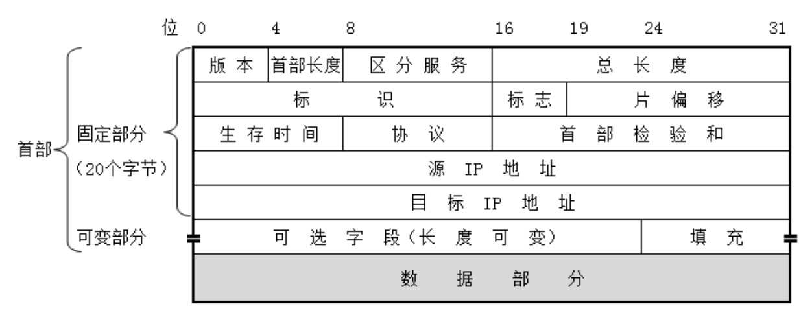

# 网络层
网络层数据包（IP数据包，Packet）由首部、数据2部分组成, 数据部分很多时候是由传输层传递下来的数据段（Segment）,而有些协议比如 ICMP、ARP 只工作在网络层，不需用到传输层数据。

下面我们通过一张图来了解网络层的首部信息：

网络层首部由 固定部分(20个字节) 和 可变部分(最大40个字节) 组成,固定部分包含 IP协议版本、首部长度、区分服务、总长度、标识、标志、片偏移、生存时间(TTL)、协议、首部检验和、源IP地址、目标IP地址组成。我们将一一讲解首部的这些信息。

>图中的每一行是4个字节，一行共32个二进制位, 0 ~ 4 是版本信息，意思是用4个二进制位表示当前IP协议版本，4 ~ 8是首部长度，意思是用4个二进制位表示首部的总长度，以此类推....

## 版本（Version）
目前常用IP协议有IPv4和IPv6 两个版本。占首部4个比特位：如果是 `0b0100` 表示是 IPv4 版本, `0b0110` 表示是 IPv6 版本。

## 首部长度 （Header Length）
首部长度占4位，由于4个比特位表达的值有限，首部长度最终的值计算方式是 `二进制的值 * 4`。

首部是由固定部分和可变部分组成，固定部分是20个字节，四个二进制位最大的值是`Ob1111` * 4 = 60,可变部分的长度最大值是40。
* 0b0101：5 * 4 = 20（首部长度最小值）
* 0b1111：15 * 4 = 60（首部长度最大值）

## 区分服务 （Differentiated Services Field）
区分服务占8位，可以用于提高网络的服务质量（QoS，Quality of Service）。客户端跟服务端在通信过程中会经过路由器转发消息，如果区分服务有值，在经过路由器时会被优先传输。区分服务主要用于区分数据的优先级。

## 总长度（Total Length）
总长度占16位,一个IP数据包的长度是 `首部 + 数据之和`，那可以计算得出，`一个IP数据包的最大值是65535`。

在我们学习数据链路层的时候，我们知道以太网帧的数据部分不能超过1500字节,所以当传输过大的IP数据包时，需要对数据包进行分片传输。每一片都有自己的网络层首部(IP首部)。标识、标志、片偏移都是用来

## 标识（Identification）
标识占16位,表示数据包的ID，当数据包过大进行分片时，同一个数据包的所有片的标识都是一样的。有一个计数器专门管理数据包的ID，每发出一个数据包，ID就加1。

## 标志（Flags）
标志占3位，每一位都表示不同的含义
* 第1位（Reserved Bit）：保留位
* 第2位（Don't Fragment）：1代表不允许分片，0代表允许分片
* 第3位（More Fragments）：1代表不是最后一片，0代表是最后一片

## 片偏移（Fragment Offset）
片偏移占13位,片偏移乘以8：字节偏移，在wireshark抓包时，已经计算好了字节偏移
每一片的长度一定是8的整数倍

## 分片
互联网协议（IP）允许资料包（英语：Datagram）进行分片（英语：fragmentation，又译分段），将资料包分割成更小的单位。这样的话，当数据包比链路最大传输单元（MTU）大时，就可以被分解为很多的足够小片段，以便能够在其上进行传输。

RFC 1191 描述了“路径MTU发现”，该技术用于确定两台IP主机间的路径MTU，这样就可以避免IP分片。

在Internet协议IPv4版本和较新的IPv6版本中，分片机制的细节和分片机制的整体框架是有所不同的。

* IPv4的分片字段均保存在IP头中，允许路由器对超大的IP数据包进行分片。
* IPv6的分片字段作为标准的扩展头部，没被包含在基本IP头中，IP协议推荐使用“路径MTU发现”来获得整个传输路径的最小MTU，从而避免IP数据包过大而需要分片，并因此不允许路由器进行分片。

## TTL

用来防止数据包不断在IP互联网上面永不终止地循环的一个值，它表示在网络层的数据包在被丢弃前最多能经过的路由器个数，

ttl的作用：防止数据包死循环运输占用流量。
ttl是网络生存时间，数据包每经过一次路由器就会-1,减到0之后路由器就会将这个包丢弃，不再转发这个包。

現代Linux系統稱為tracepath，Windows系統稱為tracert

MAC电脑可以通过 traceroute的查看当前主机到目标主机经过的路径。命令`traceroute hostname`

通过traceroute我们可以知道信息从你的计算机到互联网另一端的主机是走的什么路径。当然每次数据包由某一同样的出发点（source）到达某一同样的目的地(destination)走的路径可能会不一样，但基本上来说大部分时候所走的路由是相同的。linux系统中，我们称之为traceroute。

traceroute通过发送小的数据包到目的设备直到其返回，来测量其需要多长时间。一条路径上的每个设备traceroute要测3次。输出结果中包括每次测试的时间(ms)和设备的名称（如有的话）及其IP地址。

Linux
ping
ping 基于 ICMP 协议。利用“ping”命令可以检查网络是否连通，可以很好地帮助我们分析和判定网络故障。

traceroute
traceroute 命令利用 ICMP 协议定位源计算机和目标计算机之间的所有路由器。TTL 值可以反映数据包经过的路由器或网关的数量，通过操纵独立ICMP 呼叫报文的TTL 值和观察该报文被抛弃的返回信息，traceroute 命令能够遍历到数据包传输路径上的所有路由器。

mtr（my traceroute）
mtr 是 Linux中的一个网络连通性判断工具，它结合了ping，traceroute，nslookup 的相关特性。

nslookup
nslookup 可以指定查询的类型，可以查到DNS记录的生存时间，还可以指定使用哪个DNS服务器进行解释。

route
route 命令用于显示和操作IP路由表。

iptables
netfilter/iptables（简称为iptables）组成Linux平台下的包过滤防火墙，与大多数的Linux软件一样，这个包过滤防火墙是免费的，它可以代替昂贵的商业防火墙解决方案，完成封包过滤、封包重定向和网络地址转换（NAT）等功能。
Windows
ping
同 Linux 下的 ping

tracert
同 Linux 下的 traceroute

pathping
类似于 Linux 下的 mtr

nslookup
同 Linux 下的 nslookup

route
类似于 Linux 下的 route
相关阅读： Windows基本路由配置(cmd/route)

netsh
netsh(Network Shell) 是一个 Windows 系统本身提供的网络配置命令行工具。 可用于配置 DNS，实现端口转发等功能。