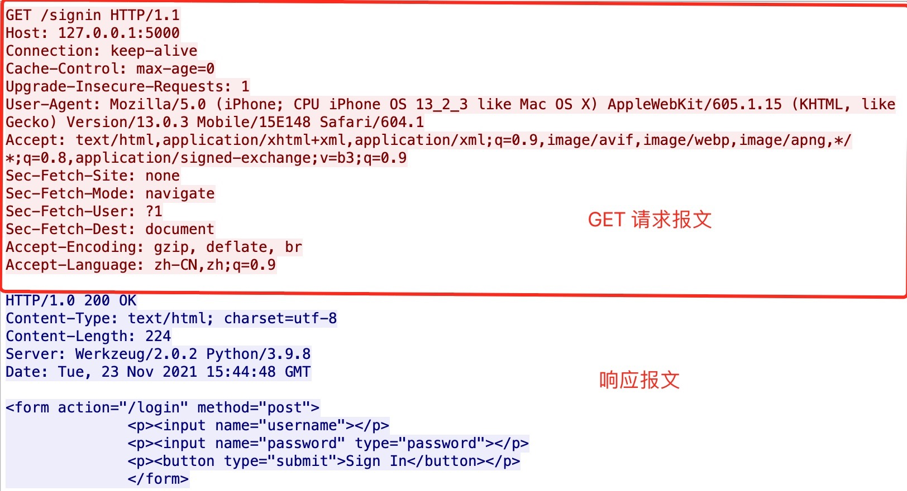
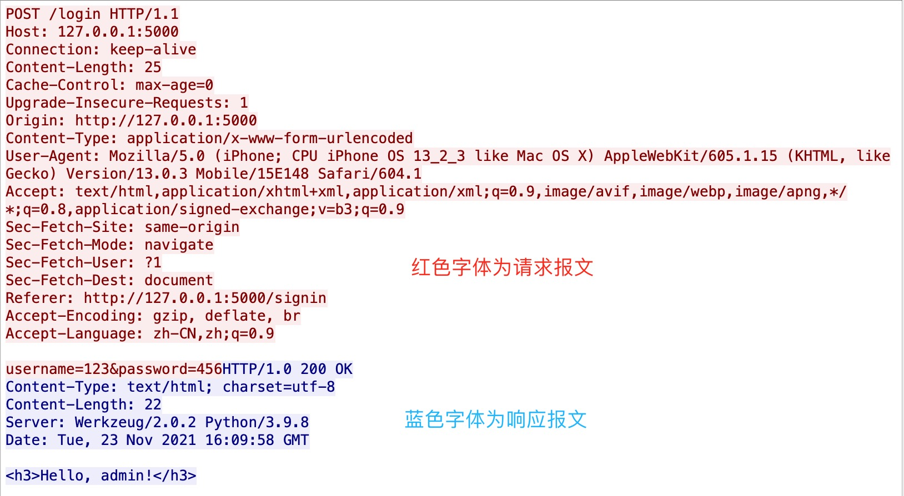

# HTTP协议
终于到了HTTP协议，在面试过程中最常问到的就是TCP和HTTP相关的协议。我们先来看看HTTP是什么？

HTTP`（Hyper Text Transfer Protocol）`，译为超文本传输协议,是互联网中应用最广泛的应用层协议之一,设计HTTP最初的目的是：提供一种发布和接收HTML页面的方法，由URI来标识具体的资源,后面用HTTP来传递的数据格式不仅仅是HTML，应用非常广泛。

从几个方面来将，HTTP的发展过程/HTTP的协议的格式，通过抓包进行验证/代理服务器/CDN/缓存几个当面来讲

>URI是 统一资源标志符,比如 `html/login.html`,URL是统一资源定位符,包含在URI中，它表示网络中具体的资源路径，比如`http://localhost:8080/hello/html/login.html`

## HTTP - 发展过程
1.  1991年，`HTTP/0.9`
    * 只支持GET请求方法获取文本数据（比如HTML文档），且不支持请求头、响应头等，无法向服务器传递太多信息
2. 1996年，`HTTP/1.0`
    * 支持POST、HEAD等请求方法，支持请求头、响应头等，支持更多种数据类型（不再局限于文本数据）
    * 浏览器的每次请求都需要与服务器建立一个TCP连接，请求处理完成后立即断开TCP连接
3. 1997年，`HTTP/1.1（最经典、使用最广泛的版本）`
    * 支持PUT、DELETE等请求方法
    * 采用持久连接（Connection: keep-alive），多个请求可以共用同一个TCP连接
4. 2015年，`HTTP/2.0`
5. 2018年，`HTTP/3.0`，处于草稿阶段

## HTTP - 报文格式
我们每次在浏览器打开一个URL地址，相当于向浏览器发送一个HTTP请求(含有请求报文),服务器返回给我们对应的数据（含有响应报文），它们的格式如下图:

 
>MAC系统使用回车符，即`CR`表示下一行`\r`,UNIX/Linux 采用换行符,即`LF`表示下一行`\n`。十六进制中回车键是`0x0D ` ,换行键是`0x0A` 

光这样干看很容易懵逼,我们通过 Wireshark 抓包对HTTP的报文进行分析。

首先使用Flask建立一个简单的web服务器,`pip3 install flask`安装Flask,下面是web服务器相关的代码,包含`signin GET请求`登录界面和`login POST`登录成功界面，Flask 默认打开 5000 端口:
```python
from flask import Flask
from flask import request

app = Flask(__name__)

@app.route('/signin', methods=['GET'])
def signin_form():
    return '''<form action="/login" method="post">
              <p><input name="username"></p>
              <p><input name="password" type="password"></p>
              <p><button type="submit">Sign In</button></p>
              </form>'''

@app.route('/login', methods=['POST'])
def login():
    # 需要从request对象读取表单内容：
    if request.form['username']=='123' and request.form['password']=='456':
        return '<h3>Hello, admin!</h3>'
    return '<h3>Bad username or password.</h3>'
if __name__ == '__main__':
    app.run()
```
`python3 xxx.py`运行web服务器,打开 Wireshark,选择监听本地5000端口`tcp.port==5000`,在网页中打开`http://127.0.0.1:5000/signin`,在 Wireshark 中我们可以看到与其相关的请求:


右键选中GET请求，选择追踪HTTP流，我们可以看到完整的请求报文和响应报文,跟图中的:



将数据跟之前的图片进行对比之后发格式基本是一致的，只是请求报文没有请求体，这是因为**GET请求本身就没有请求体，POST请求才有请求体。**在浏览器内输入用户名123，密码456，发送POST登录请求，通过Wireshark进行抓包，POST请求的报文如下图：


这下格式就完全对上了，哪有没有更严谨的方式呢？当然有啦！那就是ABNF

## HTTP - ABNF -> 最严谨的HTTP报文格式描述形式
ABNF（Augmented BNF）是BNF（Backus-Naur Form，译为：巴科斯-瑙尔范式）的修改、增强版。在[RFC 5234](https://datatracker.ietf.org/doc/html/rfc5234)中表明：**ABNF用作internet中通信协议的定义语言**。ABNF是最严谨的HTTP报文格式描述形式，脱离ABNF谈论HTTP报文格式，往往都是片面、不严谨的。关于HTTP报文格式的定义:
* 旧版 [RFC 2616 4.HTTP Message](https://datatracker.ietf.org/doc/html/rfc2616#section-4)
* 新版 [RFC 7230 3.Message Format](https://datatracker.ietf.org/doc/html/rfc7230#section-3)

### ABNF的核心规则

规则 | 形式定义 | 意义
------- | ------- | -------
ALPHA | %×41-5A / %x61-7A | 大写和小写ASCII字母 （A-Z, a-z)
DIGIT | %×30-39 | 数字 (0-9)
HEXDIG | DIGIT / "A" / "B" / "C"/  "D"/  "E"/  "F" | 十六进制数字 (0-9， A-F, a-f)
DQUOTE | %×22 | 双引号
SP | %×20 | 空格
HTAB | %X09 | 横向制表符
WSP | SP / HTAB | 空格或横向制表符
LWSP | *(WSP / CRLF WSP) | 直线空白（晚于换行）
VCHAR | %×21-7E | 可见（打印）字符
CHAR | %x01-7F | 任何7-位US-ASCII宁符，不包括NUL (%x00)
OCTET | %×00-FF | 8位数据
CTL | %×00-1F / %×7F | 控制字符
CR | %×0D  | 回车
LE | %X0A | 换行
CRLF | CR LF | 互联网标准换行 (%x0D%x0A)
BIT |  "0" / "1" | 二进制数字

### ABNF 关于 HTTP 格式的定义
在ABFN中关于报文整体格式如下:
```
HTTP-message = start-line
                *( header-field CRLF )
                CRLF
                [ message-body ]
```
解析 | 含义 | 定义
------- | ------- | -------
start-line | 请求行/响应行 | start-line = request-line / status-line
*( header-field CRLF ) | 请求头/响应头 | header-field = field-name":" OWS field-value OWS
CRLF | 回车换行
[ message-body ] | 请求体或者响应体 | message-body = *OCTET
/ | 任选一个    |   
`*` | 表示0个或多个<br>`2*`表示至少2个<br>`3*6`表示3到6个   |   
( ) | 组成一个整体  |   
[ ] | 可选（可有可无）  |   

我们知道请求报文和响应报文可以分为三部分:请求行、请求头、请求体 。响应行、响应头、响应体 。`CRLF`是回车换行,我们先看一下ABFN中关于它们的定义:
* 请求行 request-line =  method **`SP`** request-target **`SP`** HTTP-version **`CRLF`**
```
HTTP-version = HTTP-name "/" DIGIT "." DIGIT
HTTP-name = %x48.54.54.50  ;ASCII码表示 HTTP
举例:GET /hello/ HTTP/1.1
```
* 响应行 status-line = HTTP-version **`SP`** status-code **`SP`** reason-phrase **`CRLF`**
```
status-code = 3DIGIT
reason-phrase = *( HTAB / SP / VCHAR / obs-text )
举例:HTTP/1.1 200 、HTTP/1.1 200 OK
```
* 请求头/响应头 header-field = field-name ":" **`OWS`** field-value **`OWS`**
```
field-name = token
field-value = *( field-content / obs-fold )
OWS = *( SP / HTAB )
```
* 请求体/响应体 message-body = **`*OCTET`**

## HTTP - 请求方法
文档 [RFC 7231, section 4: Request methods](https://datatracker.ietf.org/doc/html/rfc7231#section-4) ：描述了8种请求方法: `GET、HEAD、POST、PUT、DELETE、CONNECT、OPTIONS、TRACE`,在 [RFC 5789, section 2: Patch method](https://datatracker.ietf.org/doc/html/rfc5789#section-2)：中描述了PATCH方法。

也就是一共9种请求方法，我们在项目中常用的只有 GET/POST 请求

方法 | 作用 | 场景
------- | ------- | -------
GET | 常用于读取的操作，请求参数直接拼接在URL的后面 **（浏览器对URL是有长度限制的）** | 
POST | 常用于添加、修改、删除的操作，请求参数可以放到请求体中（没有大小限制） | 
HEAD | 请求得到与GET请求相同的响应，但没有响应体 | 使用场景举例：在下载一个大文件前，先获取其大小，再决定是否要下载。以此可以节约带宽资源
OPTIONS | 用于获取目的资源所支持的通信选项，比如服务器支持的请求方法 | OPTIONS * HTTP/1.1
PUT | 用于对已存在的资源进行整体覆盖  |  由于不安全，一般服务器不开放该方法
PATCH | 用于对资源进行部分修改（资源不存在，会创建新的资源）  |  由于不安全，一般服务器不开放该方法
DELETE | 用于删除指定的资源  |  由于不安全，一般服务器不开放该方法
TRACE | 请求服务器回显其收到的请求信息，主要用于HTTP请求的测试或诊断
CONNECT | 可以开启一个客户端与所请求资源之间的双向沟通的通道，它可以用来创建隧道（tunnel） | 可以用来访问采用了 SSL (HTTPS) 协议的站点

## 头部字段

### 请求头字段

### 响应头字段


## 状态码
HTTP状态码由三个十进制数字组成，第一个十进制数字定义了状态码的类型，后两个数字确定具体的错误。HTTP状态码共分为5种类型：

分类 | 分类描述
------- | -------
1** |  信息，服务器收到请求，需要请求者继续执行操作
2** |  成功，操作被成功接收并处理
3** |  重定向，需要进一步的操作以完成请求
4** |  客户端错误，请求包含语法错误或无法完成请求
5** |  服务器错误，服务器在处理请求的过程中发生了错误

### 常见状态码
状态码 | 描述 | 作用
------- | ------- | -------
100 | Continue | 请求的初始部分已经被服务器收到，并且没有被服务器拒绝。客户端应该继续发送剩余的请求，如果请求已经完成，就忽略这个响应<br>允许客户端发送带请求体的请求前，判断服务器是否愿意接收请求（服务器通过请求头判断）<br>在某些情况下，如果服务器在不看请求体就拒绝请求时，客户端就发送请求体是不恰当的或低效的
200 | OK | 请求成功
302 | Found | 请求的资源被暂时的移动到了由Location头部指定的URL上
304 | Not Modified | 说明无需再次传输请求的内容，也就是说可以使用缓存的内容
400 | Bad Request | 由于语法无效，服务器无法理解该请求
401 | Unauthorized | 由于缺乏目标资源要求的身份验证凭证
403 | Forbidden | 服务器端有能力处理该请求，但是拒绝授权访问
404 | Not Found | 服务器端无法找到所请求的资源
405 | Method Not Allowed | 服务器禁止了使用当前HTTP方法的请求
406 | Not Acceptable | 服务器端无法提供与Accept-Charset以及Accept-Language指定的值相匹配的响应
408 | Request Timeout | 服务器想要将没有在使用的连接关闭,一些服务器会在空闲连接上发送此信息，即便是在客户端没有发送任何请求的情况下
500 | Internal Server Error | 所请求的服务器遇到意外的情况并阻止其执行请求
501 | Not Implemented | 请求的方法不被服务器支持，因此无法被处理。服务器必须支持的方法（即不会返回这个状态码的方法）只有 GET 和 HEAD
502 | Bad Gateway | 作为网关或代理角色的服务器，从上游服务器（如tomcat）中接收到的响应是无效的
503 | Service Unavailable | 服务器尚未处于可以接受请求的状态。通常造成这种情况的原因是由于服务器停机维护或者已超载


* [HTTP教程](https://www.runoob.com/http/http-tutorial.html)