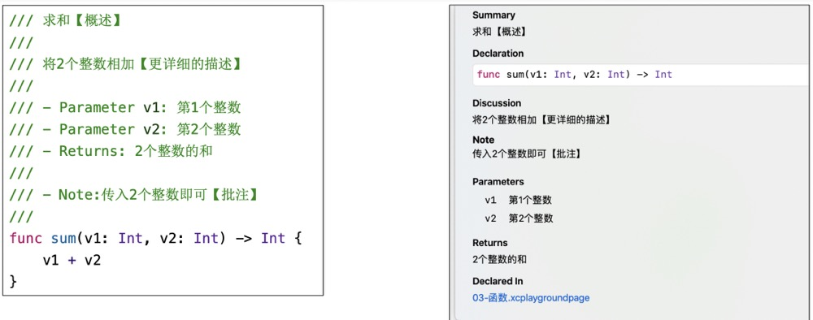
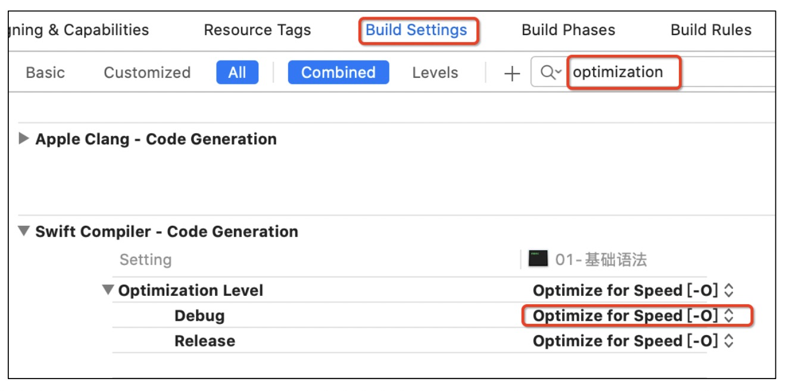

# 函数
Swift中函数的表达式是`func 方法名(形参: 形参类型) -> 返回类型`,在调用方法时,如果想不添加形参名，可以使用`func 方法名(_ 形参: 形参类型) -> 返回类型`的形参进行忽略。

函数一般分为有返回值、无返回值、有参数、没有参数的方式。在Swift中需要注意的是，可以通过返回元组的当时返回多个返回值。Swift 中方法的注释如下图,也可以参考[Swift设计准则](https://www.swift.org/documentation/api-design-guidelines/)：



## 隐式返回（Implicit Return）
如果整个函数体是一个单一表达式，那么函数会隐式返回这个表达式,也就是不需要写return了。如下面的代码:
```swift
func sum(v1: Int, v2: Int) -> Int {
    v1 + v2
}
sum(v1: 10, v2: 20) /
```

## 返回元组：实现多返回值
```swift
// 计算参数的 和、 差 、平均值
func calculate(v1: Int, v2: Int) -> (sum: Int, difference: Int, average: Int) {
let sum = v1 + v2
    return (sum, v1 - v2, sum >> 1)
}

let result = calculate(v1: 20, v2: 10)
result.sum // 30
result.difference // 10
result.average // 15
```

## 参数标签（Argument Label）
可以修改参数标签,在调用方法时语句更通顺。也可以使用下划线` _ `省略参数标签。
```swift
func goToWork(at time: String) {
    print("this time is \(time)")
}
goToWork(at: "08:00") // this time is 08:00

// 省略参数标签
func sum(_ v1: Int, _ v2: Int) -> Int {
    v1 + v2
}
sum(10, 20)
```

## 默认参数值（Default Parameter Value）
参数可以有默认值,在写方法时直接添加默认值。
```swift
func check(name: String = "nobody", age: Int, job: String = "none") {
    print("name=\(name), age=\(age), job=\(job)")
}

check(name: "Jack", age: 20, job: "Doctor") // name=Jack, age=20, job=Doctor
check(name: "Rose", age: 18) // name=Rose, age=18, job=none
check(age: 10, job: "Batman") // name=nobody, age=10, job=Batman
check(age: 15) // name=nobody, age=15, job=none
```
C++的默认参数值有个限制：必须从右往左设置。由于Swift拥有参数标签，因此并没有此类限制
，但是在省略参数标签时，需要特别注意，如果中间参数没有默认值，形参名称不能省略。
```swift
// 这里的middle不可以省略参数标签
func test(_ first: Int = 10, middle: Int, _ last: Int = 30) { }
test(middle: 20)
```

## 可变参数（Variadic Parameter）
在参数类型后面加上`...`表示这个是一个可变参数。可以传多个相同类型的参数。
```swift
func sum(_ numbers: Int...) -> Int {
    var total = 0
    for number in numbers {
        total += number
    }
    return total
}
sum(10, 20, 30, 40) // 100
```
一个函数最多只能有1个可变参数,紧跟在可变参数后面的参数不能省略参数标签。主要是避免歧义。
```swift
// 参数string不能省略标签
func test(_ numbers: Int..., string: String, _ other: String) { }
test(10, 20, 30, string: "Jack", "Rose")
```
在Swift自带的print函数中使用的就是可变参数
```swift
/// print函数的定义
/// items: 可变参数，并且可以忽略参数名
/// separator: 打印多个参数时的拼接符
/// terminator: 打印多个参数时的拼接符
public func print(_ items: Any..., separator: String = " ", terminator: String = "\n")
// print函数的使用
print(1, 2, 3, 4, 5) // 1 2 3 4 5
print(1, 2, 3, 4, 5, separator: "_") // 1_2_3_4_5
print("My name is Jake.", terminator: "")
print("My age is 18.")
// My name is Jake.My age is 18.
```

## 输入输出参数（In-Out Parameter）
可以用`inout`定义一个输入输出参数,在调用方法时传入参数的地址。**这样可以在函数内部修改外部实参的值**。
```swift
func swapValues(_ v1: inout Int, _ v2: inout Int) {
    let tmp = v1
    v1 = v2
    v2 = tmp
}
var num1 = 10
var num2 = 20
swapValues(&num1, &num2)

// 交换2个参数的值可以用元组的方式进行交换
func swapValues(_ v1: inout Int, _ v2: inout Int) {
    (v1, v2) = (v2, v1)
}
```
inout可输入参数的注意点：
```markdown
* 可变参数不能标记为inout
* inout参数不能有默认值
* inout参数只能传入可以被多次赋值的
* inout参数的本质是地址传递（引用传递）
```

## 函数重载（Function Overload）
函数重载的规则就是函数名相同,`参数个数 || 参数类型 || 参数标签`只要有一个不同就属于函数重载。比如下面这些方法就属于函数重载：
```swift
func sum(v1: Int, v2: Int) -> Int {
}
func sum(v1: Int, v2: Int, v3: Int) -> Int {
} // 参数个数不同
func sum(v1: Int, v2: Double) -> Double {
} // 参数类型不同
func sum(v1: Double, v2: Int) -> Double {
} // 参数类型不同
func sum(_ v1: Int, _ v2: Int) -> Int {
} // 参数标签不同
func sum(a: Int, b: Int) -> Int {
} /
```
函数重载的注意点有：
```markdown
* 返回值类型与函数重载无关
* 默认参数值和函数重载一起使用产生二义性时，编译器并不会报错（在C++中会报错）
* 可变参数、省略参数标签、函数重载一起使用产生二义性时，编译器有可能会报错
```

##  内联函数（Inline Function）
如果开启了编译器优化（Release模式默认会开启优化），编译器会自动将某些函数变成内联函数
也就是将函数调用展开成函数体。

函数体比较长、包含递归调用、包含动态派发等这些函数不会被自动内联

## 函数类型（Function Type）
每一个函数都是有类型的，函数类型由形式参数类型、返回值类型组成。比如下面的代码：
```swift
func test() { } //函数类型是: () -> Void 或者 () -> ()

func sum(a: Int, b: Int) -> Int {
    a + b
}  //函数类型是: (Int, Int) -> Int

// 定义变量
var fn: (Int, Int) -> Int = sum
fn(2, 3) // 5，调用时不需要参数标签
```
函数既然是有类型的，那也就可以将它当做参数添加到函数中，比如下面的代码:
```swift
func sum(v1: Int, v2: Int) -> Int {
    v1 + v2
}
func difference(v1: Int, v2: Int) -> Int {
    v1 - v2
}
func printResult(_ mathFn: (Int, Int) -> Int, _ a: Int, _ b: Int) {
    print("Result: \(mathFn(a, b))")
}
printResult(sum, 5, 2) // Result: 7
printResult(difference, 5, 2) // Result: 3
```
也可以将函数类型作为函数返回值，返回值是函数类型的函数，叫做高阶函数`（Higher-Order Function）`.比如：
```swift
func next(_ input: Int) -> Int {
    input + 1
}
func previous(_ input: Int) -> Int {
    input - 1
}
func forward(_ forward: Bool) -> (Int) -> Int {
    forward ? next : previous
}
forward(true)(3) // 4
forward(false)(3) // 2
```

## typealias 起别名
typealias 可以给函数或者类型起别名，当做一种新的类型。在函数传参的时候直接使用别名当做类名。


## 嵌套函数（Nested Function）
函数嵌套是将函数定义在函数内部。
```swift
func forward(_ forward: Bool) -> (Int) -> Int {
    func next(_ input: Int) -> Int {
        input + 1
    }
    func previous(_ input: Int) -> Int {
        input - 1
    }
    return forward ? next : previous
}
forward(true)(3) // 4
forward(false)(3) // 2
```