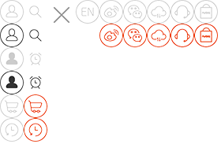

# CSS 布局
布局有三种方式： 常规流、浮动、绝对定位

## 常规流
常规流中包含 行级、块级、表格布局、Flexbox、Grid布局

## 元素类型
根据元素的显示类型，HTML元素可以主要分为两大类: `块级元素` 和 `行内级元素`。行级元素是只占一行的位置，盒模型中的`width`、`height`不适用与行级元素。
* 块级元素独占父元素一行，包含的HTML标签有：div、p、pre、h1~h6、ul、ol、li、dl、dt、dd、table、form、article、aside、footer、header、hgroup、main、nav、section、blockquote、hr等
* 行内级元素可以多个元素在同一行父元素中显示，包含的HTML标签有：a、img、span、strong、code、iframe、label、input、button、canvas、embed、object、video、audio等

**display修改元素的显示类型：**
```css
display: flex; /* 伸缩布局 */
display: inline;  /* 行级元素 */
display: block; /* 块级元素 */
display: inline-block; /* 本身是行级，可以放在行盒中，可以设置宽高，作为一个整体不会被拆散成多行 */
display: none;/* 此元素不会被显示,排版时完全被忽略 */
```

### 行级元素
质保函行级盒子的容器会创建一个IFC
IFC内的排版规则
* 盒子在一行内水平摆放
* 一行放不下时，换行显示
* text-align 决定一行内盒子的水平对齐
* vertical-align 决定一个盒子在行内的垂直对齐
* 避开浮动(float)元素

## 弹性盒子布局 Flexible Box 
控制盒子的 摆放流向、摆放顺序、盒子的宽度和高度、水平和垂直方向的对齐、是否允许折行
```css
/* 生成一个块级的Flex容器 */
display: flex ;
/* 生成一个行级的Flex容器 */
display: inline-flex;
/* 控制摆放方向 */
flex-direction:row;
/* 允许换行 */
flex-wrap:wrap;

/* 剩余空间时的伸展能力 */
flex-grow:
/* 剩余空间不足时的收缩能力 */
flex-shrink:
/* 没有伸展或者收缩时的基础长度 */
flex-basis:

/* 主轴方向的排序，主轴：空间排列方向 */
justify-content: start;

/* 侧轴方向 */
align-items: center;

/* 针对单个元素的对齐方式 */
align-self: flex-end;

/* 设置行的内容 */
align-content: center;

/* 单个元素使用，第几个元素 */
order:1;
```

### Grid布局
```css
/* 生成一个块级的Grid容器 */
display: grid ;
/* 
grid-template-columns 有几个值，代表有几列
grid-template-rows: 有几个值，代表有几行
有三种表示形式

 */
grid-template-columns: 100px 200px 300px 400px;
grid-template-rows: 100px 50px;

grid-template-columns: 30% 20% auto;
grid-template-rows: 100px auto;

grid-template-columns: 100px 1fr 1fr;
grid-template-rows: 100px 1fr;

/* 修改单个网格布局大小 ,以分割线做区分，分割线以 1 开始*/
.a{
    grid-column-start: 1;
    grid-row-start: 1;
    grid-row-end: 3;
    grid-column-end: 3;
}
/* 等价于 */
.a{
    grid-area:1/1/3/3;
}

/* 设置行和列之间的间距 ,gap 同时设置行和列的间距*/
row-gap: 10px;
column-gap: 10px;
gap: 10px 10px;

/* 行方向是否填满整个块级元素, 默认填满 */
align-items: stretch;
/* 列方向是否填满整个块级元素，默认填满 */
justify-items: stretch;

/* 单独设置某个item 在列方向的位置 */
align-self: center;
/* 单独设置某个item 在行方向的位置 */
justify-self: center;

/* 当元素不会占满整个容器的时候，使用align-content  和 justify-content */

```
#### 网格线命名

第一种方式，给网格线起一个别名，修改单个单元格的时候可以直接使用别名


第二种方式,命名一个区域，可以直接使用区域进行赋值


## 浮动

1. 浮动有左浮动和右浮动两种
2. 浮动的元素会向左或向右浮动，碰到父元素边界、浮动元素、未浮动的元素才停下来
3. 相邻浮动的块元素可以并在一行，超出父级宽度换行
4. 浮动让行内元素或块元素自动转化为行内块元素
5. 浮动元素后面没有浮动的元素会占据它的位置，没有浮动的元素内的文字会避开浮动的元素，形成文字饶图的效果
6. 父元素没有高度时，浮动的元素无法撑开父元素，需要清除浮动
7. 浮动元素之间没有垂直margin的合并

### 清除浮动
```css
/* 1、父级上增加属性 overflow:hidden */
.box{
    overflow:"hidden";
}
/* 2、最后一个子元素的后面加一个空的div，样式属性clear:both <不推荐使用> */
<div style="clear:both"></div>


/* 3、使用成熟的清浮动样式类 clearfix */

.clearfix:after,.clearfix:before{ content: "";display: table;}
.clearfix:after{ clear:both;}
.clearfix{zoom:1;}

/* 第二种 clearfix 清除方式 */
.con2{... overflow:hidden}
或者
<div class="con2 clearfix">

```

## 定位流布局
* relative、 生成相对定位元素，元素占据的文档流位置不变，元素本身相对文档流进行偏移
* absolute、绝对定位，元素脱离文档流，不占据文档流的位置，相对与显示屏幕的宽高进行定位
* fixed、固定的定位元素，脱离文档流，不占据文档流位置，相对与窗口进行定位
* static、默认值，相当于取消定位属性，或者不设置定位属性
* inherit、从父元素集成position属性的值

### relative 相对定位
相对自己以前的位置，进行重新定位，相对定位是不脱离文档流的
```css
.box2{
    width:100px;
    height:100px;
    position: relative;
    top: 10px;
    left: 10px;
    background-color: sandybrown;
}
```

### absolute 绝对定位
绝对定位是脱离文档流位置的，绝对定位不区分行内元素/块级元素/行内块级元素,根据显示屏幕的宽高进行定位，如果父级元素是绝对定位，则会根据父级元素进行定位。**绝对定位搭配相对定位进行使用，子绝父相**,绝对定位水平居中的方式,**只要设置left 是50%， margin-left是物体的负数宽度的一半就可以了**

```css
.box2{
    width:100px;
    height:100px;
    position: adbsolute;
    left:50%;
    margin-left: -50px; 
    background-color: sandybrown;
}
```

## 绝对定位 和 相对定位的区别
position 的四个值：static、relative、absolute、fixed。默认是static,absolute 和 fixed 统称为绝对定位,relative是相对定位。

**relative相对定位特点:**
1. 元素设置此属性之后仍然处在文档流中，不影响其他元素的布局。
2. 设置left和top时，元素相对于原来位置偏移，宽高不变。

**absolute绝对定位特点:**
1. 元素会脱离文档流。脱离文档流后原来的位置相当于是空的，下面的元素会来占据它的位置。
2. 元素在没有定义宽度的情况下，宽度由元素里面的内容决定，效果和用float方法一样。
3. 设置left或者top时，如果父元素没有相对或者决定定位的情况下，元素相对于根元素定位
4. 如果父元素设置了相对定位或绝对定位，元素会选择离自己最近的父元素进行定位


### 典型的定位布局

1. 固定在顶部的菜单
2. 水平垂直居中的弹框
3. 固定的侧边工具栏
4. 固定在底部的按钮

## 盒子模型

* 盒子宽度 = width + padding左右 + border左右
* 盒子高度 = height + padding上下 + border上下
* box-sizing: border-box;  盒子包含border在内的宽度
* overflow:  内容溢出的时候行为

盒子模型图解 


边框 border

```css
border-top:10px solid red;
设置边框
border-top-color:red;    /* 设置顶部边框颜色为红色 */  
border-top-width:10px;   /* 设置顶部边框粗细为10px */   
border-top-style:solid;  /* 设置顶部边框的线性为实线，
常用的有：solid(实线)  
  dashed(虚线)  dotted(点线); */
```

内间距 padding

padding是根据父控件的宽度

```css
padding-top：20px;     /* 设置顶部内间距20px */ 
padding-left:30px;     /* 设置左边内间距30px */ 
padding-right:40px;    /* 设置右边内间距40px */ 
padding-bottom:50px;   /* 设置底部内间距50px */

简写，按照 上 左 下 右的规则进行排序
padding：20px 40px 50px 30px; /* 四个值按照顺时针方向，分别设置的是 上 右 下 左  
四个方向的内边距值。 */

设置不同值表示的意义不同

padding：20px 40px 50px; /* 设置顶部内边距为20px，左右内边距为40px，底部内边距为50px */ 
padding：20px 40px; /* 设置上下内边距为20px，左右内边距为40px*/ 
padding：20px; /* 设置四边内边距为20px */
```

### 盒子使用技巧
#### margin相关技巧
1、设置元素水平居中： margin:x auto;
2、margin负值让元素位移及边框合并

#### 外边距合并

外边距合并指的是，当两个垂直外边距相遇时，它们将形成一个外边距。合并后的外边距的高度等于两个发生合并的外边距的高度中的较大者。解决方法如下：

1、使用这种特性
2、设置一边的外边距，一般设置margin-top
3、将元素浮动或者定位

#### margin-top 塌陷

在两个盒子嵌套时候，内部的盒子设置的margin-top会加到外边的盒子上，导致内部的盒子margin-top设置失败，解决方法如下：

1、外部盒子设置一个边框
2、外部盒子设置 overflow:hidden
3、使用伪元素类：

```css
.clearfix:before{
    content: '';
    display:table;
}
```

### 阴影 box-shadow
```css
box-shadow: 1px 2px 3px 0 gray
1px: 水平上的偏移量
2px: 垂直上的偏移量
3px: 阴影模糊的程度
0: 阴影扩张的大小
```

### 行高和垂直对齐 vertical-align


### 值和单位
关键字： initial/inherit
字符串： “string”
URL： url(/logo.png)
长度：100px、5em
百分比： 50%
整数： z-index:5
浮点数： line-height:1.8
颜色： #ff0000
时间： 300ms

长度的表示方法
px： 像素点
in  英寸
cm  厘米
mm  毫米
pt  磅 1/72 英寸
pc  1/6 英寸
em  元素字体大小
rem html字体大小
vh  1%窗口高
vw  1%窗口宽
vmax    vwvh 较大者
vmin    vwvh 较小者

##  background 属性
背景元素属性，可以在一个div元素中设置多个背景图像（并指定他们的位置）,可以设置的属性分别是：background-color、background-position、background-size、background-repeat、background-origin、background-clip、background-attachment 和 background-image。
各值之间用空格分隔，除`background-size`必须紧跟`background-position`之外不分先后顺序。

语法:
`background:bg-color bg-image position/bg-size bg-repeat bg-origin bg-clip bg-attachment initial|inherit;`

值 | 说明 | 使用方式
------- | ------- | -------
background-image | 指定要使用的一个或多个背景图像,会覆盖在background-color上面 | `background-image: url(./a.jpg),url(./b.png);`
background-repeat | 按照什么方式重复背景图像 | * repeat:默认值，背景图将向垂直和水平方向重复<br>* repeat-x: 只有水平位置会重复背景图像<br>* repeat-y: 只有垂直位置会重复背景图像<br>* no-repeat: background-image不会重复<br>* inherit: 指定background-repea属性设置应该从父元素继承
background-color | 指定要使用的背景颜色 | 1
background-position | 指定背景图像的位置 | `left right center top bootom`或`background-position: 25% 75%;`
background-size | 指定背景图片的大小 | `cover contain`或`background-size: 50% auto`<br>`background-size: 50%`:只写一个数字表示宽度是%50，高度根据宽高比自动计算
background-origin | 指定背景图像的定位区域 | 3
background-clip | 指定背景图像的绘画区域,根据盒子模型的边距进行剪切 | * border-box: 默认值，背景绘制在边框方框内（剪切成边框方框）<br>* padding-box: 背景绘制在衬距方框内<br>* content-box: 背景绘制在内容方框内。
background-attachment | 设置背景图像是否固定或者随着页面的其余部分滚动。 | * scroll: 默认值，背景图片随着页面的滚动而滚动<br>* fixed: 背景图片不会随着页面的滚动而滚动<br>* local: 背景图片会随着元素内容的滚动而滚动。

**background使用技巧:**
制作滑动门按钮: 两边圆角的按钮可以使用背景图进行制作，两边圆角各切一张图，中间纯色是一张图。利用平铺的方式对中间图片进行平铺。组成圆角按钮

**CSS Sprite 精灵图**
精灵图是一种CSS图像合成技术，将各种小图片合并到一张图片上，利用CSS的背景定位来显示对应的图片部分。注意：控件的大小要跟图标一致，向左是-x,向下是-y。比如这张精灵图


如果使用红色的微博图标，参考下面的代码
```css
div{
    width: 30px;
    height: 30px;
    background-image: url(./web_img_2.png);
    background-position: -126px -30px;
    background-repeat: no-repeat;
}
```
