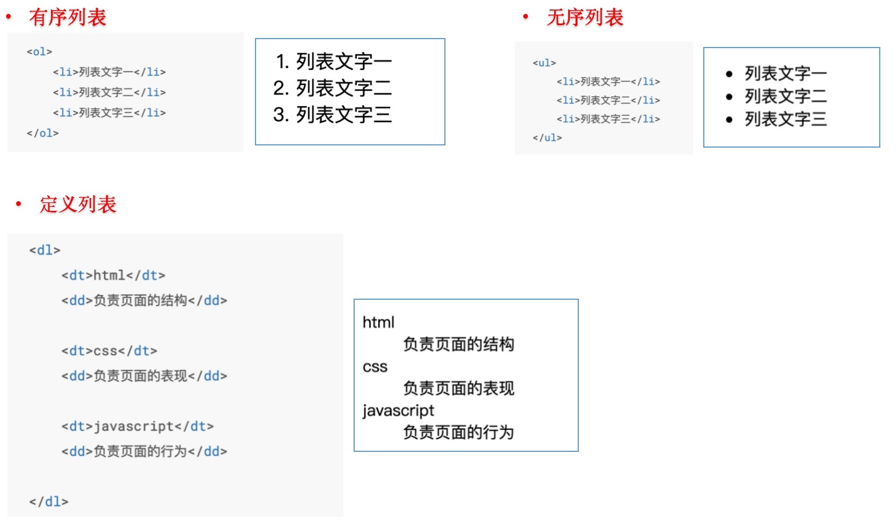

# HTML

超文本标记语言（HyperText Markup Language，简称：HTML）是一种用于创建网页的标准标记语言。文件的扩展名为html或者htm。HTML文档由无数个标签组成，由标签和内容组成的成为元素（element）。

## HTML的基础结构
通过下面的代码认识一下HTML的结构:

```html
<!DOCTYPE html>
<html>
    <head>
        <meta charset="utf-8">
        <title>网页标题</title>
    </head>
    <body>
    
    </body>
</html>
```
* `<!DOCTYPE html>` HTML文档声明，告诉浏览器当前页面是 HTML5 文档
* `<html>` 元素是 HTML 页面的根元素
* `<head>` 元素包含了文档的元（meta）数据，如 `<meta charset="utf-8">` 定义网页编码格式为 utf-8。
* `<title>` 元素描述了文档的标题
* `<body>` 元素包含了可见的页面内容

## 常用元素
HTML提供了大量元素，每一个元素都有特定的用途。大部分标签是以标签对的格式进行使用`<元素名>具体内容</元素名>`,`meta、img、br、input`没有包含具体内容，书写格式是单标签`<元素名>`。[点击查看HTML5所有标签](https://www.runoob.com/tags/html-reference.html)
```html
区块： div
区分： span
文本： p、h1~h6、em、dt、dd
表格： table、tbody、thread、tr、td、th、tfoot、caption
表单： form、input、label、textarea、select
链接： a
图片： img
音频： audio
视频： video
文档： html、head、title、body、meta
列表： ul、ol、li、dlside、footer、nav
其他： br、hr、iframe
结构： header、section、a、strong、pre、address、q、blockquote、cite、code
```
每一个标签都可以拥有自己的属性，属性可以增加元素的功能，书写格式是`<起始标签 属性名="属性值">`，比如`<body id="box">`。[点击查看HTML5全局属性](https://www.runoob.com/tags/ref-standardattributes.html)全局属性是每个标签都可以使用的属性

另外HTML 事件触发浏览器中的行为，比方说当用户点击某个 HTML 元素时启动一段 JavaScript，称为事件。[点击查看HTML5事件属性](https://www.runoob.com/tags/ref-eventattributes.html)

## 常用的标签
标签 | 作用 | 示例
------- | ------- | -------
`<h1>` | 标题H1-H6，搜索引擎会使用标题将网页的结构和内容编制索引，H1标签SEO优化。 | `<h1>标题</h1>`
`<p>` | 段落  | `<p>标题</p>`
`<bt/>` | 换行 | 
`` | 图像 | `` <br> img只设置宽度或者高度，浏览器会自动根据宽高比自动计算
`<a>` | 超链接 | `<a href="http://www.baidu.com" target="">`
`<iframe>` | 在当前 HTML 文档中嵌入另一个文档 | ` <iframe src="http://www.baidu.com" frameborder="0"></iframe>`
`<ol>` | 无序列表
`<ul>` | 有序列表
`<textarea>` | 多行文本输入框
`<video>` | 视频播放器
`<textarea>` | 多行文本输入框
`<marquee>` | 跑马灯 `direction` 控制方向`up/down/right`
`&nbsp;` | 空格 | 字符实体
`&lt;` | <  | 字符实体
`&gt;` | >  | 字符实体
`&copy;` | 版权符号  | 字符实体

## 锚点
锚点可以实现:跳转到网页中的具体位置。需要先在跳转的位置设置id，按钮的链接使用`#id`的模式
```html
 <a href="#first">跳转到对应锚点</a>
 <h2 id="first">定义锚点</h2>
```

## 行内元素 和 块元素
### html块
1、div标签 块元素，表示一块内容，没有具体的语义。
2、span标签 行内元素，表示一行中的一小段内容，没有具体的语义。

### 含样式和语义的标签
1、em标签 行内元素，表示语气中的强调词
2、i标签 行内元素，原本没有语义，w3c强加了语义，表示专业词汇
3、b标签 行内元素，原本没有语义，w3c强加了语义，表示文档中的关键字或者产品名
4、strong标签 行内元素，表示非常重要的内容

### 语义化的标签
语义化的标签，就是在布局的时候多使用语义化的标签，搜索引擎在爬网的时候能认识这些标签，理解文档的结构，方便网站的收录。比如：h1标签是表示标题，p标签是表示段落，ul、li标签是表示列表，a标签表示链接，dl、dt、dd表示定义列表等，语义化的标签不多


## 列表
列表有三种：自定义列表、有序列表、无序列表


## 表格

```html
<table border="1">
    <caption>表格标题</caption>
    <tr>
        <th>动物</th>
        <th>水果</th>
        <th>植物</th>
    </tr>
    <tr >
        <td>猫</td>
        <td>苹果</td>
        <td rowspan="2">花</td>
    </tr>
    <tr >
        <td>狗</td>
        <td>香蕉</td>
    </tr>
    
</table>
```

* `<table>`   表格标签
* `<th>`   表格头部
* `<caption>`   表格标题
* `<tr>`   一行
* `<td>`   一列
* `border`   表格宽度，不赋值不显示表格
* `rowspan`  合并列
* `colspan`  合并行

## 表单
表单是用来手机用户信息的

```html
<form>
    账号：<input type="text" value="请输入账号">
    密码：<input type="password">
    
    <br>

    <!-- 单选框 -->
    性别：
    <input type="radio" name="gender"> 男
    <input type="radio" name="gender"> 女
    <input type="radio" name="gender" checked="checked"> 保密

    <br>

    <!-- 多选框 -->
    爱好：
    <input type="checkbox"> 篮球
    <input type="checkbox"> 足球
    <input type="checkbox"> 排球
    <input type="checkbox"> 读书

</form>
```

### 按钮

使用提交按钮，需要知道提交给谁，提交哪些数据？

首先在 `from` 表单设置跳转目标 `action`,点击时提交按钮时会使用 `name="user"` 输入框的数据，提交结果`https://www.baidu.com/?user=123`

```html
<form action="https://www.baidu.com/">
    账号：<input type="text" name="user">

    <br>

    <!-- 按钮 -->
        <input type="button" value="按钮">
        <input type="submit">
        <input type="reset">
</form>
```

### label标签
label 和 input进行绑定，点击label，input会聚焦

```html
<form>
    <label for="accout">账号：</label><input type="text" id="accout">
    <label for="pwd">密码：</label><input type="text" id="pwd">
</form>
```

## selected标签

```html
<select>
    <optgroup label="河南">
        <option>新乡</option>
        <option>信阳</option>
        <option selected>郑州</option>
        <option>开封</option>
    </optgroup>
</select>
```
* optgroup 组标题
* selected 默认选中
* option 一组

## html快捷键

!和html:5 可以快速生成完整结构的html5代码

`>` 和 `+`
div>ul>li 快速生成
```
<div>
    <ul>
        <li></li>
    </ul>
</div>
```

div+p+bq
```
<div></div>
<p></p>
<blockquote></blockquote>
```
div+div>p>span+em
```
<div></div>
<div>
    <p><span></span><em></em></p>
</div>
```

`*` 和`^`
ul>li*3
```
<ul>
    <li></li>
    <li></li>
    <li></li>
    <li></li>
    <li></li>
</ul>
```

div+div>p>span+em^h1
```
<div></div>
<div>
    <p><span></span><em></em></p>
    <h1></h1>
</div>
```

`()`
div>(header>ul>li*2>a)+footer>p
```
<div>
    <header>
        <ul>
            <li><a href=""></a></li>
            <li><a href=""></a></li>
        </ul>
    </header>
    <footer>
        <p></p>
    </footer>
</div>
```

(div>dl>(dt+dd)*3)+footer>p
```
<div>
    <dl>
        <dt></dt>
        <dd></dd>
        <dt></dt>
        <dd></dd>
        <dt></dt>
        <dd></dd>
    </dl>
</div>
<footer>
    <p></p>
</footer>
```

属性
div#footer+div.page+div#footer.class1.class2.class3
```
<div id="header"></div>
<div class="page"></div>
<div id="footer" class="class1 class2 class3"></div>
```

td[title=hello]
```
<td title="hello"></td>
```

td[title=hello colspan=3]
`<td title="hello" colspan="3"></td>`

td[title colspan]
`<td title="" colspan=""></td>`

$: 代表索引 
ul>li.item$*5
```
<ul>
    <li class="item1"></li>
    <li class="item2"></li>
    <li class="item3"></li>
    <li class="item4"></li>
    <li class="item5"></li>
</ul>
```

ul>li.item$@4*5
```
<ul>
    <li class="item4"></li>
    <li class="item5"></li>
    <li class="item6"></li>
    <li class="item7"></li>
    <li class="item8"></li>
</ul>
```

{}
a{click}
`<a href="">click</a>`
a>{click}+span{here}
`<a href="">click<span>here</span></a>`

隐式标签：因为一些标签下面的子标签是固定的，所以不用写也没问题
ul>.item*3
```
<ul>
    <li class="item"></li>
    <li class="item"></li>
    <li class="item"></li>
</ul>
```

table>#row$*4>[colspan=2]
```
<table>
    <tr id="row1">
        <td colspan="2"></td>
    </tr>
    <tr id="row2">
        <td colspan="2"></td>
    </tr>
    <tr id="row3">
        <td colspan="2"></td>
    </tr>
    <tr id="row4">
        <td colspan="2"></td>
    </tr>
</table>
```

css
w100=`width: 100px;`

## 扩展知识
**相对路径 和 绝对路径**

* `./ ` 表示当前文件所在目录下，比如：`./pic.jpg` 表示当前目录下的pic.jpg的图片，这个使用时可以省略。
* ` ../ ` 表示当前文件所在目录下的上一级目录，比如：`../images/pic.jpg` 表示当前目录下的上一级目录下的images文件夹中的pic.jpg的图片。

**图片格式**
* png: 静态图片，支持透明
* jpg: 静态图片，不支持透明
* gif: 动态图片、静态图片，支持透明

像素: 屏幕成像是由一个个像素点组成的，可以把像素点比作一个格子，一个格子中只能有一种颜色。像素越高图片质量越清晰。

URL的基本格式： `协议://主机地址/路径`
协议：不同的协议，代表不同的资源查找方式、资源传输方式
主机地址： 服务器的ip地址或者域名
路径：资源在主机中的具体位置


## 单词
element： 元素
